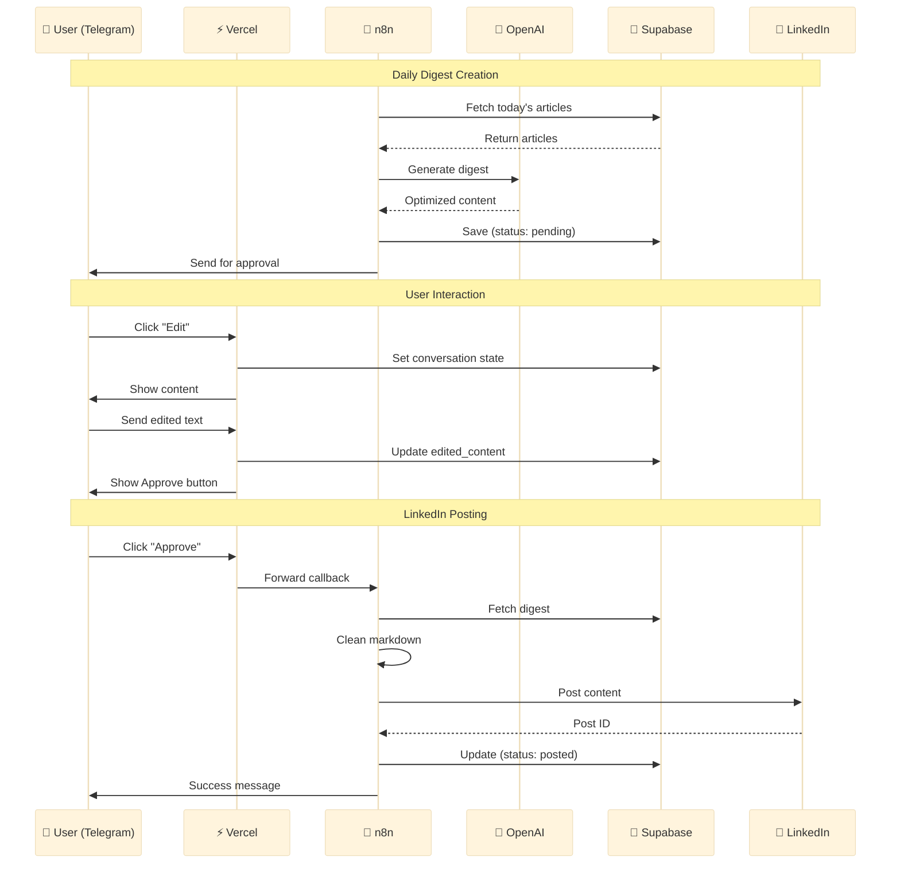

<div align="center">

# 🌐 Tech News Automation Platform

### AI-Powered News Aggregation & Distribution System

[](https://opensource.org/licenses/MIT)
[](https://nodejs.org/)
[](https://www.typescriptlang.org/)
[](https://reactjs.org/)
[](https://vercel.com)
[](https://sentry.io)

[Live Demo](https://cemkoyluoglu.codes) · [Documentation](#-documentation) · [Report Bug](https://github.com/CemRoot/My-Site/issues) · [Request Feature](https://github.com/CemRoot/My-Site/issues)

</div>

---

## 📋 Table of Contents

- [Overview](#-overview)
- [Key Features](#-key-features)
- [Architecture](#-architecture)
- [Tech Stack](#-tech-stack)
- [Quick Start](#-quick-start)
- [Telegram Bot](#-telegram-bot-control-center)
- [Automation](#-automation-workflows)
- [Configuration](#-configuration)
- [Deployment](#-deployment)
- [Monitoring](#-monitoring--observability)
- [Documentation](#-documentation)
- [Contributing](#-contributing)
- [Security](#-security)
- [License](#-license)

---

## 🎯 Overview

**Tech News Platform** is an enterprise-grade, fully automated news aggregation and distribution system that combines cutting-edge AI, intelligent scraping, and seamless automation to deliver tech news in real-time.

### 🌟 What Makes This Special?

- **🤖 AI-Powered**: Unlimited-length translation using Groq AI (Llama 3.3 70B)
- **📱 Telegram Control Center**: Full system control from your phone
- **🔄 100% Automated**: GitHub Actions + Vercel integration
- **📊 Production-Ready**: Sentry monitoring, health checks, deployment tracking
- **⚡ Lightning Fast**: Supabase backend, optimized queries
- **🔒 Enterprise Security**: Rate limiting, API secrets, fail-safe mechanisms
- **👁️ Real-Time Monitoring**: Error tracking, performance monitoring, session replay

---

## ✨ Key Features

### 🗞️ News Aggregation System

<table>
<tr>
<td width="50%">

#### Intelligent Scraping
- Multi-category support (7+ categories)
- Smart rate limiting (respects API limits)
- Duplicate detection & prevention
- Source attribution & tracking
- Original article link preservation

</td>
<td width="50%">

#### AI Translation
- Turkish → English translation
- Context-aware processing
- Social media embed preservation
- Markdown formatting retention
- Quality validation checks

</td>
</tr>
</table>

### 🤖 Telegram Bot Control Center

<table>
<tr>
<td width="50%">

#### Interactive Menu System
- 📰 Manual scraping trigger
- ➕ Manual article addition
- 🏥 System health checks
- 📊 Real-time statistics
- 💾 Database management
- 🔧 GitHub Actions control
- 📱 LinkedIn digest management

</td>
<td width="50%">

#### Automated Notifications
- ✅ Success reports
- ❌ Error alerts with details
- 📈 Daily health summaries
- 🚀 Deployment notifications
- 🚨 Vercel status alerts
- 📱 Real-time updates

</td>
</tr>
</table>

### 🔄 Full Automation

- **Scheduled Scraping**: 3x daily on weekdays (09:30, 13:00, 16:00 UTC)
- **Manual Article Scraper**: On-demand article processing via Telegram
- **LinkedIn Digest**: Daily automated post generation (16:30 UTC via n8n)
- **Vercel Status Monitor**: 30-min interval platform health checks
- **Auto Deployment**: Vercel CI/CD with post-build hooks
- **Self-Healing**: Automatic retries, fallback mechanisms
- **Monitoring**: System health tracking, API status checks, RSS monitoring
- **GitHub Integration**: Workflow triggers, status reporting

### 💼 Portfolio Website

- Modern liquid glass design
- AI-powered chat widget (Groq)
- Responsive & accessible
- SEO optimized
- Dark/Light theme support

---

## 🏗️ Architecture

> **Enterprise-Grade System Design** following Google Cloud Architecture best practices

### 🎨 High-Level Architecture


### 📊 Component Architecture

| Layer | Components | Technology | Purpose |
|-------|-----------|------------|---------|
| **Edge** | CDN, Cache | Vercel Edge Network | Global content delivery, <100ms latency |
| **Frontend** | React SPA, UI Components | React 18, TypeScript, Vite | User interface, real-time updates |
| **API Gateway** | Serverless Functions | Vercel Edge Functions | Request routing, authentication |
| **Orchestration** | Workflows, Schedulers | GitHub Actions, n8n | Automation, scheduled tasks |
| **AI/ML** | Translation, Generation | Groq AI, OpenAI, Firecrawl | Content processing, intelligence |
| **Observability** | Monitoring, Logging | Sentry, Custom Health Checks | Error tracking, performance monitoring |
| **Data** | Database, Storage | Supabase PostgreSQL | Persistent storage, real-time sync |
| **Communication** | Messaging, Notifications | Telegram Bot, LinkedIn API | User interaction, distribution |

---

### 📊 LinkedIn Digest Workflow (n8n)


---

### 🔄 Data Flow



---

### 🗂️ System Components

| Layer | Component | Technology | Version | Purpose |
|-------|-----------|------------|---------|---------|
| **Frontend** | React SPA | React + TypeScript | 18.3 | Modern, responsive UI |
| | Build Tool | Vite | 6.4 | Fast build & HMR |
| | State Management | Context API | - | Global state handling |
| | Styling | Tailwind CSS + Radix UI | 3.x | Component library |
| **Backend** | API Gateway | Vercel Edge Functions | - | Serverless endpoints |
| | Webhooks | Telegram, Deployment | - | Event handling |
| | Security | Rate Limiting, CORS | - | API protection |
| **Database** | Primary DB | Supabase PostgreSQL | 15.x | Structured data storage |
| | Real-time | Supabase Subscriptions | - | Live data sync |
| | Storage | Supabase Storage | - | File/asset storage |
| **Orchestration** | Workflows | GitHub Actions | - | Scheduled automation |
| | Business Logic | n8n | - | Complex workflows |
| | Cron Jobs | GitHub Actions Cron | - | Time-based triggers |
| **AI/ML** | Translation | Groq AI (Llama 3.3 70B) | - | Multi-language support |
| | Content Gen | OpenAI GPT-4o-mini | - | LinkedIn digests |
| | Web Scraping | Firecrawl API | v1 | Article extraction |
| | Chat Widget | Groq AI (Llama 3.3) | - | User interaction |
| **Observability** | Error Tracking | Sentry | 7.119 | Frontend & backend |
| | Performance | Sentry Performance | - | APM, traces, spans |
| | Session Replay | Sentry Replay | - | User session recording |
| | Health Checks | Custom Scripts | - | System monitoring |
| | Logging | Vercel Logs + GitHub | - | Centralized logging |
| **Communication** | Bot Platform | Telegram Bot API | - | Interactive control |
| | Social Media | LinkedIn API (n8n OAuth) | - | Content distribution |
| | Email | Newsletter System | - | Subscriber management |
| **Infrastructure** | Hosting | Vercel Edge Network | - | Global CDN, <100ms |
| | CI/CD | GitHub Actions + Vercel | - | Automated deployments |
| | DNS | Custom Domain | - | cemkoyluoglu.codes |

---

### 🔐 Security Architecture

#### Authentication & Authorization
- **API Keys**: Encrypted storage in GitHub Secrets & Vercel Environment Variables
- **Webhook Validation**: Telegram webhook signature verification with secret tokens
- **Chat ID Authorization**: Restricted access to authorized Telegram users
- **n8n OAuth**: Secure LinkedIn authentication with automatic token refresh
- **UUID Validation**: RFC 4122 compliant identifier verification

#### Data Protection
- **Database Security**: Row Level Security (RLS) in Supabase PostgreSQL
- **SQL Injection Prevention**: Parameterized queries, input sanitization
- **XSS Protection**: HTML sanitization, Content Security Policy
- **CORS Configuration**: Origin whitelisting, allowed domains only
- **Conversation State**: Time-limited sessions (10 minutes), auto-cleanup

#### Application Security
- **Rate Limiting**: 10 requests/minute per user (Vercel Edge Functions)
- **Callback Deduplication**: Prevents infinite loops & duplicate processing
- **Error Message Sanitization**: No sensitive data in client-facing errors
- **Sentry Data Filtering**: PII masking, sensitive data exclusion
- **Deployment Webhooks**: Secure webhook endpoints with secret validation

#### Infrastructure Security
- **HTTPS Only**: TLS 1.3 encryption for all communications
- **Environment Isolation**: Separate credentials for dev/preview/production
- **Secrets Rotation**: Regular API key rotation policy (90 days)
- **DDoS Protection**: Vercel Edge Network built-in protection
- **Dependency Scanning**: Automated vulnerability detection (GitHub Dependabot)

---

## 🛠️ Tech Stack

### Frontend
| Technology | Version | Purpose |
|-----------|---------|---------|
| **React** | 18.3 | UI Framework |
| **TypeScript** | 5.0 | Type Safety |
| **Vite** | 6.3 | Build Tool |
| **Tailwind CSS** | 3.x | Styling |
| **Radix UI** | Latest | Components |
| **React Router** | 7.9 | Navigation |
| **React Markdown** | 10.1 | Content Rendering |

### Backend & APIs
| Service | Purpose | Tier/Plan |
|---------|---------|-----------|
| **Supabase** | PostgreSQL Database | Free/Pro |
| **Groq AI** | Translation & Chat | Free (Unlimited) |
| **OpenAI** | LinkedIn Digest Generation | Free Credits |
| **Firecrawl** | Web Scraping | Free (500/mo) |
| **n8n** | Workflow Automation | Free/Self-hosted |
| **Telegram Bot API** | Notifications & Control | Free (Unlimited) |
| **GitHub Actions** | CI/CD & Automation | Free (2000 min/mo) |
| **Sentry** | Error Tracking & Monitoring | Developer (5K errors/mo) |

### Infrastructure
| Platform | Purpose | Cost |
|----------|---------|------|
| **Vercel** | Hosting & Edge Functions | Free/Pro |
| **GitHub** | Version Control & Actions | Free |
| **Cloudflare** | DNS & CDN (optional) | Free |

---

## 🚀 Quick Start

### Prerequisites

```bash
node >= 20.0.0
npm >= 10.0.0
git >= 2.40.0
```

### Installation

```bash
# 1. Clone the repository
git clone https://github.com/CemRoot/My-Site.git
cd My-Site

# 2. Install dependencies
npm install

# 3. Setup environment variables
cp .env.example .env

# 4. Add your API keys to .env
# See Configuration section below

# 5. Start development server
npm run dev
```

### First-Time Setup

```bash
# Setup Telegram bot menu
npm run telegram:setup-menu

# Run initial health check
npm run health:check

# Test translation system
npm run test:translation
```

---

## 📱 Telegram Bot Control Center

### Features

The Telegram bot provides complete system control from your mobile device:

```
┌─────────────────────────────────┐
│     🤖 TECH NEWS BOT MENU       │
├─────────────────────────────────┤
│  📰 Haberleri Çek               │
│  📱 LinkedIn Posts              │
│  🏥 Sağlık Kontrolü             │
│  📊 Sistem Durumu               │
│  📈 İstatistikler               │
│  🔧 GitHub Actions              │
│  💾 Veritabanı                  │
│  🔄 Menüyü Yenile               │
│  ℹ️ Yardım                      │
└─────────────────────────────────┘

LinkedIn Posts Sub-Menu:
┌─────────────────────────────────┐
│  🚀 Manuel Digest Oluştur       │
│  📊 Pending Digests             │
│  ✅ Posted Digests              │
│  🔙 Ana Menü                    │
└─────────────────────────────────┘
```

### Available Commands

| Command | Description |
|---------|-------------|
| `/start` | Initialize bot and show menu |
| `/menu` | Display main control menu |
| `/linkedin` | LinkedIn digest management |
| `/status` | Quick system status |
| `/scrape` | Trigger news scraping |
| `/health` | Run health check |
| `/help` | Show help and commands |

### Setup

```bash
# 1. Create Telegram bot with @BotFather
# 2. Get bot token and chat ID
# 3. Add to environment variables
TELEGRAM_BOT_TOKEN=your_token
TELEGRAM_CHAT_ID=your_chat_id

# 4. Setup bot menu
npm run telegram:setup-menu

# 5. Test in Telegram
# Send: /start
```

---

## 🔄 Automation Workflows

### Scheduled Jobs

| Workflow | Schedule | Purpose |
|----------|----------|---------|
| **Scrape Tech News** | 09:30, 13:00, 16:00 UTC (M-F) | Collect & translate news |
| **Manual Article Scraper** | On-demand via Telegram | Process single articles |
| **System Health Check** | 08:00 UTC (Daily) | Monitor system health |
| **Vercel Status Monitor** | Every 30 minutes | Monitor Vercel platform status |
| **LinkedIn Digest** | 16:30 UTC (Daily) | Generate & post digest (n8n) |

### Manual Triggers

All workflows can be triggered manually:

```bash
# Via GitHub Actions UI
Actions → [Workflow Name] → Run workflow

# Via Telegram Bot
/menu      # Open interactive menu
/scrape    # Trigger news scraping
/health    # Run health check
/linkedin  # Manage LinkedIn digests

# Via npm scripts
npm run scrape:news          # Manual scraping
npm run health:check         # Health check
npm run vercel:status        # Check Vercel status

# Via API
curl -X POST "https://your-site.com/api/telegram-control?action=trigger-scrape" \
  -H "Authorization: Bearer YOUR_SECRET"
```

### Deployment Automation

```
Git Push → Vercel Build → Post-Build Hook → Bot Setup → Telegram Notification
```

---

## ⚙️ Configuration

### Environment Variables

#### Required for Development

```env
# AI Services
GROQ_API_KEY=gsk_...                    # Groq AI for translation
FIRECRAWL_API_KEY=fc-...                # Firecrawl for scraping

# Database
NEXT_PUBLIC_SUPABASE_URL=https://...    # Supabase project URL
NEXT_PUBLIC_SUPABASE_ANON_KEY=eyJ...    # Public anon key
SUPABASE_SERVICE_ROLE_KEY=eyJ...        # Service role key (admin)

# Telegram Bot
TELEGRAM_BOT_TOKEN=123456:ABC...        # Bot token from @BotFather
TELEGRAM_CHAT_ID=123456789              # Your chat ID
```

#### Optional (Production)

```env
# Security
TELEGRAM_CONTROL_API_SECRET=random_key  # API endpoint security
DEPLOYMENT_WEBHOOK_SECRET=random_hex    # Deployment webhook security

# Sentry Error Tracking & Monitoring
VITE_SENTRY_DSN=https://key@org.ingest.sentry.io/project  # Frontend DSN
VITE_SENTRY_ENVIRONMENT=production      # Environment name
VITE_APP_VERSION=1.0.0                  # Release version
SENTRY_DSN=https://key@org.ingest.sentry.io/project       # Backend DSN
SENTRY_ENVIRONMENT=production           # Backend environment
SENTRY_AUTH_TOKEN=your_auth_token       # Upload source maps (optional)
SENTRY_ORG=your-org-slug                # Organization slug (optional)
SENTRY_PROJECT=your-project-slug        # Project slug (optional)

# GitHub Integration
GITHUB_TOKEN=ghp_...                    # For workflow triggers
GITHUB_REPOSITORY=username/repo         # Repository name

# Analytics
VERCEL_ANALYTICS_ID=your_id            # Vercel Analytics

# n8n Integration (Unified Workflow)
N8N_LINKEDIN_WORKFLOW_WEBHOOK=https://your-n8n.app.n8n.cloud/webhook/linkedin-digest  # Unified LinkedIn digest workflow
```

### GitHub Secrets

Add these in: `Repository Settings → Secrets and variables → Actions`

```
GROQ_API_KEY
FIRECRAWL_API_KEY
NEXT_PUBLIC_SUPABASE_URL
SUPABASE_SERVICE_ROLE_KEY
TELEGRAM_BOT_TOKEN
TELEGRAM_CHAT_ID
GITHUB_TOKEN (auto-provided)
```

### Vercel Environment Variables

Add in: `Vercel Dashboard → Project → Settings → Environment Variables`

- Copy all variables from `.env`
- Select: Production, Preview, Development
- Click "Save"

---

## 🚢 Deployment

### Vercel (Recommended)

#### Quick Deploy

[](https://vercel.com/new/clone?repository-url=https://github.com/CemRoot/My-Site)

#### Manual Deploy

```bash
# 1. Install Vercel CLI
npm i -g vercel

# 2. Login to Vercel
vercel login

# 3. Deploy
vercel

# 4. Deploy to production
vercel --prod
```

### Post-Deployment

```bash
# Automatic (via postbuild hook)
# - Bot commands configured
# - Telegram notification sent
# - Menu updated

# Manual setup (if needed)
npm run telegram:setup-menu
```

---

## 📊 Monitoring & Observability

> **Production-grade monitoring** following industry best practices

### 🔍 Error Tracking (Sentry)

**Real-time error monitoring across frontend and backend:**

```typescript
// Frontend Error Tracking
- Automatic error capture (React Error Boundaries)
- Performance monitoring (Core Web Vitals)
- Session replay (video-like recordings)
- Breadcrumbs (user action timeline)
- Source maps (readable stack traces)
- User context tracking
- Release tracking per deployment

// Backend Error Tracking  
- API endpoint errors
- Serverless function failures
- Database connection issues
- Third-party API failures
- Request context (headers, query params)
- Environment tagging (production/preview)
```

**Sentry Dashboard Features:**
- 📊 **Issues**: Grouped errors with stack traces
- ⚡ **Performance**: Slow transactions & API calls
- 🎬 **Session Replay**: Watch user sessions with errors
- 📈 **Releases**: Track errors per deployment
- 🔔 **Alerts**: Slack/Email notifications for critical errors

**Limits (Developer Plan):**
- 5,000 errors/month
- 50 session replays/month
- 5M performance spans/month
- 5 GB logs/month

### 🏥 Health Checks

```bash
# Comprehensive system health check
npm run health:check

# Automated (daily at 08:00 UTC)
✅ Supabase database connectivity
✅ Firecrawl API availability  
✅ Groq AI API status
✅ Telegram Bot responsiveness
✅ Vercel platform health
✅ Recent article metrics
✅ System resource usage

# Vercel status monitoring
npm run vercel:status

# Automated (every 30 minutes)
🔍 RSS feed monitoring
🚨 Incident detection & alerts
📊 Duplicate prevention
📱 Telegram notifications
⏰ Status change tracking
```

### 📱 Telegram Notifications

**Automatic notifications for all system events:**

| Event | Notification Type | Frequency |
|-------|------------------|-----------|
| ✅ **Scraping Success** | Success report + stats | Per workflow run |
| ❌ **Scraping Errors** | Error details + logs | Immediate |
| 🏥 **Health Reports** | System status summary | Daily 09:00 |
| 🚀 **Build Completed** | Build success | Per deployment |
| 📦 **Deploy Success** | Deployment confirmed | Per deployment |
| ⚠️ **Deploy Failed** | Error notification | Immediate |
| 🚨 **Vercel Incidents** | Platform status alerts | Real-time |
| 📱 **LinkedIn Digest** | Approval requests | Daily 16:30 |
| 💾 **Database Issues** | Connection failures | Immediate |
| 🔐 **Security Alerts** | Rate limit exceeded | Immediate |

### 📈 System Dashboard

**Access via Telegram bot (`/menu`):**

```
📊 Real-Time Metrics:
├── Total articles in database
├── Articles added today (last 24h)
├── Last article timestamp  
├── Supabase connection status
├── API services health status
├── Vercel platform status
├── GitHub Actions workflow status
└── System uptime percentage

🔍 Monitoring Features:
├── Live error tracking (Sentry)
├── Performance metrics
├── API response times
├── Database query performance
├── User session analytics
└── Deployment history
```

### 📋 Logging Strategy

**Multi-tier logging system:**

| Level | Platform | Content | Retention |
|-------|----------|---------|-----------|
| **Application** | Vercel Logs | API requests, errors | 7 days (Free) |
| **Workflow** | GitHub Actions | Build logs, automation | 90 days |
| **Errors** | Sentry | Stack traces, context | 90 days |
| **Database** | Supabase | Query logs, slow queries | 7 days |
| **Custom** | Telegram | Critical events | Permanent |

### 🎯 Observability Best Practices

- ✅ **Structured logging** with consistent formats
- ✅ **Correlation IDs** for request tracing
- ✅ **Performance budgets** (<200ms API responses)
- ✅ **Error rate thresholds** (<1% failure rate)
- ✅ **Automated alerting** for critical issues
- ✅ **Post-mortem analysis** for incidents
- ✅ **Regular health check reviews** (weekly)

---

## 📚 Documentation

### Setup Guides
- [📰 Tech News Setup](./docs/TECH_NEWS_SETUP.md) - Complete scraping system setup
- [🗄️ Supabase Setup](./docs/SUPABASE_SETUP.md) - Database configuration
- [📱 Telegram Bot Setup](./docs/TELEGRAM_NOTIFICATIONS_SETUP.md) - Bot configuration
- [🔧 General Setup](./docs/SETUP.md) - Initial project setup
- [💼 LinkedIn n8n Setup](./docs/n8n-setup-instructions.md) - Step-by-step n8n workflow setup
- [🚨 Vercel Status Monitor](./docs/VERCEL_STATUS_SETUP.md) - Platform monitoring setup
- [👁️ Sentry Integration](./docs/SENTRY_SETUP.md) - **NEW!** Error tracking & monitoring setup
- [🔔 Deployment Webhooks](./docs/DEPLOYMENT_WEBHOOK_SETUP.md) - **NEW!** Deployment status notifications

### System Documentation
- [🏗️ Architecture](./docs/IMPLEMENTATION_SUMMARY.md) - System architecture
- [🔄 Automation](./docs/SYSTEM_RELIABILITY.md) - Reliability & automation
- [📊 Monitoring](./docs/TECH_NEWS_MONITORING.md) - Monitoring system
- [🗃️ Database Schema](./docs/supabase-schema.sql) - PostgreSQL schema
- [📋 LinkedIn Workflow Guide](./docs/N8N_UNIFIED_WORKFLOW_GUIDE.md) - **NEW!** Unified workflow architecture
- [📝 Vercel Status Changelog](./docs/CHANGELOG_VERCEL_STATUS.md) - **NEW!** Recent system updates

### Deployment Guides
- [🚀 Deployment Checklist](./docs/DEPLOYMENT_CHECKLIST.md) - Pre-deployment checks
- [📦 Vercel Setup](./docs/VERCEL_SETUP_GUIDE.md) - Vercel configuration
- [🔧 Tech News Deployment](./docs/TECH_NEWS_DEPLOYMENT.md) - News system deployment
- [✅ Vercel Env Checklist](./docs/VERCEL_ENV_CHECKLIST.md) - **NEW!** Environment variables guide

### Testing & Quality
- [🧪 Test Scenarios](./docs/TEST_SCENARIOS.md) - **NEW!** Complete testing guide for LinkedIn system

### API Documentation
- [📡 Telegram Webhook](./api/telegram-webhook.js) - Webhook handler
- [🎛️ Control API](./api/telegram-control.js) - Control endpoints
- [📰 Tech News API](./api/tech-news.js) - News endpoints

---

## 🤝 Contributing

We welcome contributions! Please see our [Contributing Guide](./CONTRIBUTING.md) for details.

### Development Workflow

```bash
# 1. Fork the repository
# 2. Create your feature branch
git checkout -b feature/AmazingFeature

# 3. Commit your changes
git commit -m 'Add some AmazingFeature'

# 4. Push to the branch
git push origin feature/AmazingFeature

# 5. Open a Pull Request
```

### Code Style

- TypeScript for new code
- ESLint + Prettier for formatting
- Meaningful commit messages
- Test your changes locally

---

## 🔒 Security

### Reporting Vulnerabilities

Please report security vulnerabilities to: **cemkoyluoglu@icloud.com**

### Security Features

- ✅ **API Rate Limiting** (10 requests/minute per user)
- ✅ **UUID Validation** (RFC 4122 compliant)
- ✅ **Chat ID Authorization** (Telegram webhook)
- ✅ **Environment Variable Encryption**
- ✅ **Webhook Signature Verification**
- ✅ **SQL Injection Prevention** (Parameterized queries)
- ✅ **XSS Protection** (HTML sanitization)
- ✅ **CORS Configuration** (Origin whitelisting)
- ✅ **LinkedIn OAuth Security** (n8n handles authentication)
- ✅ **Duplicate Post Prevention** (Status checks)
- ✅ **Error Message Sanitization** (No sensitive data exposure)

### Best Practices

```bash
# Never commit secrets
echo ".env" >> .gitignore

# Use API secrets
TELEGRAM_CONTROL_API_SECRET=random_64_char_string

# Rotate keys regularly
# - Every 90 days for production
# - Immediately if compromised
```

---

## 📈 Performance

### Metrics

| Metric | Target | Actual |
|--------|--------|--------|
| **Lighthouse Score** | > 90 | 95+ |
| **First Contentful Paint** | < 1.5s | ~1.2s |
| **Time to Interactive** | < 3s | ~2.5s |
| **API Response Time** | < 200ms | ~150ms |
| **Translation Speed** | < 5s | ~3-4s |

### Optimization

- Static generation for pages
- Image optimization (WebP)
- Code splitting & lazy loading
- CDN caching (Vercel Edge)
- Database query optimization
- API response caching

---

## 📜 Scripts Reference

### Development
```bash
npm run dev                     # Start dev server (port 5173)
npm run build                   # Production build
npm run preview                 # Preview production build
```

### Tech News System
```bash
npm run scrape:news             # Manual news scraping
npm run fix:original-sources    # Fix missing source links
npm run migrate:supabase        # Migrate to Supabase
npm run test:translation        # Test translation quality
```

### Telegram Bot
```bash
npm run telegram:setup-menu     # Setup bot menu
npm run telegram:webhook-setup  # Configure webhook
npm run telegram:webhook-remove # Remove webhook
```

### LinkedIn Automation (n8n + Vercel)

**The new system uses ONE unified n8n workflow + Vercel for secure LinkedIn digest automation.**

#### Architecture:
```
┌──────────────────────────────────────────────────────┐
│  n8n Unified Workflow: LinkedIn Digest System       │
│                                                      │
│  ENTRY POINT 1: Daily Schedule (16:30 UTC Daily)   │
│  ENTRY POINT 2: Manual Trigger (Telegram Button)   │
│           ↓                                          │
│  ├── Workflow Configuration                         │
│  ├── Check Duplicate (Skip if exists)              │
│  ├── Fetch articles from Supabase                  │
│  ├── Generate digest with OpenAI GPT-4o-mini       │
│  ├── Save to linkedin_digest_posts (pending)       │
│  └── Send Telegram message (4 buttons)             │
└──────────────────────────────────────────────────────┘
                    ↓ User clicks "Approve/Reject/View/Edit"
┌──────────────────────────────────────────────────────┐
│  Vercel Webhook: Security Layer                     │
│  ├── UUID validation (RFC 4122)                    │
│  ├── Rate limiting (10 req/min per user)           │
│  ├── Chat ID authorization                         │
│  └── Forward to n8n callback webhook →             │
└──────────────────────────────────────────────────────┘
                    ↓
┌──────────────────────────────────────────────────────┐
│  n8n Callback Handler (Same Workflow)               │
│  ├── Parse callback data                            │
│  ├── Switch (approve/reject/view/edit)             │
│  ├── Get digest from DB                            │
│  ├── Post to LinkedIn (n8n OAuth)                  │
│  ├── Update DB (status: posted/rejected)           │
│  └── Send Telegram confirmation                     │
└──────────────────────────────────────────────────────┘
```

#### Setup Requirements:
1. **n8n LinkedIn OAuth** (in n8n credentials)
   - Connect LinkedIn account in n8n
   - OAuth handles token refresh automatically
2. **One Unified n8n Workflow** (see `docs/n8n-setup-instructions.md` for step-by-step guide)
3. **Vercel Environment Variables:**
   ```bash
   N8N_LINKEDIN_WORKFLOW_WEBHOOK=https://your-n8n.app.n8n.cloud/webhook/linkedin-digest
   ```
   **Note:** This is the ONLY webhook needed. Old webhook variables are deprecated:
   - ~~N8N_LINKEDIN_CALLBACK_WEBHOOK~~ (Deprecated)
   - ~~N8N_MANUAL_DIGEST_WEBHOOK~~ (Deprecated)

#### How It Works:

**Automatic Daily Digest:**
1. **n8n Schedule Trigger** activates at 16:30 UTC (Weekdays)
2. **Workflow** checks for duplicates, fetches articles
3. **OpenAI GPT-4o-mini** generates LinkedIn digest
4. **Telegram** sends approval message with 4 buttons

**Manual Digest (New Feature!):**
1. **User** opens `/linkedin` command or menu
2. **Clicks** "🚀 Manuel Digest Oluştur" button
3. **Vercel** forwards request to n8n
4. **n8n** generates digest for today's articles
5. **Telegram** sends approval message immediately

**Approval Flow:**
1. **User clicks "Approve"** → Telegram forwards to Vercel
2. **Vercel** performs security checks & forwards to n8n
3. **n8n Callback Handler** posts to LinkedIn (OAuth)
4. **Confirmation** sent to Telegram ✅

#### Why This Design?
- ✅ **No LinkedIn API tokens in Vercel** (Security)
- ✅ **n8n handles OAuth** (Automatic refresh)
- ✅ **Vercel provides security layer** (Rate limiting, validation)
- ✅ **Unified workflow** (Easier maintenance, single source of truth)
- ✅ **Manual + Automatic** (Flexibility for both scheduled and on-demand)
- ✅ **Duplicate prevention** (Check database before creation)

#### Legacy Commands (Deprecated):
```bash
npm run linkedin:analyze        # Deprecated - Use n8n Workflow #1
npm run linkedin:post           # Deprecated - Use Telegram approval
npm run linkedin:test           # Not needed - n8n OAuth handles auth
```

**Note:** The legacy `linkedin_posts` table and Vercel-based LinkedIn posting are deprecated. New system uses `linkedin_digest_posts` with n8n OAuth for better security and UX.

### Monitoring
```bash
npm run health:check            # System health check
npm run test:webhook            # Test webhook
```

---

## 🎯 Roadmap

### ✅ Completed
- [x] Multi-category news scraping
- [x] AI-powered translation
- [x] Telegram bot control system
- [x] GitHub Actions automation
- [x] Supabase migration
- [x] Health monitoring system
- [x] LinkedIn digest automation (n8n + Vercel)
- [x] Manual digest creation (Telegram)
- [x] LinkedIn OAuth integration (n8n)
- [x] Email newsletter signup

### 🚧 In Progress
- [ ] RSS feed generation
- [ ] Article search functionality
- [ ] User bookmarking system
- [ ] Advanced analytics dashboard

### 📋 Planned
- [ ] Multi-language support (Spanish, French)
- [ ] Mobile app (React Native)
- [ ] AI-powered article summarization
- [ ] Social media auto-posting
- [ ] Newsletter email delivery
- [ ] Custom category subscriptions

---

## 💼 Use Cases

### For News Outlets
- Automated content aggregation
- Multi-language translation
- Social media distribution
- Analytics & insights

### For Developers
- Modern React/TypeScript template
- CI/CD best practices
- API integration examples
- Telegram bot implementation

### For Businesses
- Internal news distribution
- Team notifications
- Content curation
- Automated reporting

---

## 🏆 Acknowledgments

- [Groq AI](https://groq.com/) - Lightning-fast AI inference
- [Firecrawl](https://firecrawl.dev/) - Reliable web scraping
- [Supabase](https://supabase.com/) - Open-source Firebase alternative
- [Vercel](https://vercel.com/) - Seamless deployment platform
- [Telegram](https://telegram.org/) - Secure messaging platform

---

## 📞 Contact & Support

<div align="center">

### Dr. Cem Koyluoglu (CK)

[](mailto:cemkoyluoglu@icloud.com)
[](https://www.linkedin.com/in/cem-koyluoglu/)
[](https://github.com/CemRoot)
[](https://wa.me/353873445918)

📍 **Dublin, Ireland** | 🌍 **Available Worldwide**

</div>

---

## 📄 License

This project is licensed under the **MIT License** - see the [LICENSE](LICENSE) file for details.

```
MIT License

Copyright (c) 2025 Cem Koyluoglu

Permission is hereby granted, free of charge, to any person obtaining a copy
of this software and associated documentation files (the "Software"), to deal
in the Software without restriction, including without limitation the rights
to use, copy, modify, merge, publish, distribute, sublicense, and/or sell
copies of the Software, and to permit persons to whom the Software is
furnished to do so, subject to the following conditions:

The above copyright notice and this permission notice shall be included in all
copies or substantial portions of the Software.
```

---

<div align="center">

### ⭐ If you find this project useful, please consider giving it a star!

**Made with ❤️ in Dublin, Ireland**

[⬆ Back to Top](#-tech-news-automation-platform)

---

**Last Updated**: October 22, 2025 | **Version**: 2.2.0

[](https://github.com/CemRoot/My-Site)
[](https://github.com/CemRoot/My-Site)
[](http://makeapullrequest.com)

</div>
