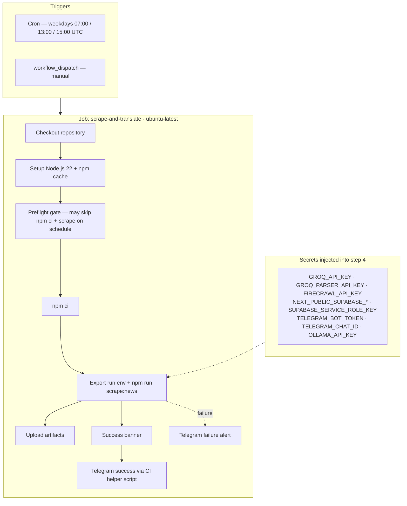
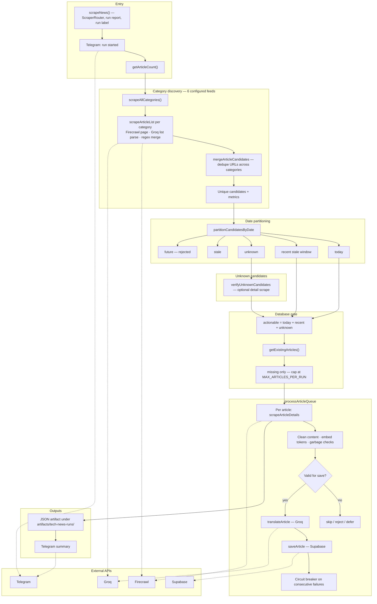

<div align="center">

# 🌐 Tech News Automation Platform

### AI-Powered News Aggregation & Distribution System

[](https://opensource.org/licenses/MIT)
[](https://nodejs.org/)
[](https://www.typescriptlang.org/)
[](https://reactjs.org/)
[](https://vite.dev/)
[](https://vercel.com)
[](https://sentry.io)

[Live Demo](https://cemkoyluoglu.codes) · [Report Bug](https://github.com/CemRoot/My-Site/issues) · [Request Feature](https://github.com/CemRoot/My-Site/issues)

</div>

---

## 📋 Table of Contents

- [Overview](#-overview)
- [Key Features](#-key-features)
- [Architecture](#-architecture)
- [Daily News Agent](#-daily-news-agent)
- [Tech Stack](#-tech-stack)
- [Quick Start](#-quick-start)
- [Telegram Bot](#-telegram-bot-control-center)
- [Automation](#-automation-workflows)
- [Scrape Tech News Architecture](#-scrape-tech-news-architecture-and-data-flow)
- [Configuration](#-configuration)
- [Deployment](#-deployment)
- [Monitoring](#-monitoring--observability)
- [Contributing](#-contributing)
- [Security](#-security)
- [License](#-license)

---

## 🎯 Overview

This repository is a personal portfolio site that is also a **running system**,
not a static brochure. The public site at
[cemkoyluoglu.codes](https://cemkoyluoglu.codes) is the front door; behind it sit
scrapers that pull tech news on a schedule, AI agents that translate and score
it, a RAG chatbot grounded in the author's CV and projects, and a Telegram bot
that operates the whole thing from a phone.

The frontend is deliberately part of the story: the site's own architecture is
what the "Systems" section on the home page describes.

### 🌟 What Makes This Special?

- **🤖 AI-Powered**: Multi-AI system (Groq Llama 3.3 + Google Gemini 2.0 Flash)
- **💬 AI Chatbot**: Interactive portfolio chatbot with n8n fallback
- **📊 Relevance Ranking**: Articles carry a scrape-time importance score, blended
  at query time with view count and 14-day publish-date freshness in a Postgres RPC
- **📱 Telegram Control Center**: Full system control from your phone
- **🔄 100% Automated**: GitHub Actions + n8n + Vercel integration
- **🎨 Editorial Frontend**: Hand-built design system, EN/TR i18n, and a 3D
  wireframe hero compressed ~330× so it stays off the critical path
- **📈 Production-Ready**: Sentry monitoring, health checks, deployment tracking
- **🔒 Security-Conscious**: Rate limiting, secret hygiene, strict CSP,
  least-privilege database functions

---

## ✨ Key Features

### 🗞️ News Aggregation System

<table>
<tr>
<td width="50%">

#### Intelligent Scraping
- Deterministic daily agent across 6 business categories
- Smart rate limiting (respects API limits)
- Duplicate detection & prevention
- Source attribution & tracking
- Original article link preservation
- Replayable run artifacts for rejected/failed/deleted batches
- **Manual article scraper via Telegram**

</td>
<td width="50%">

#### AI Translation & Processing
- Turkish → English translation (Groq AI)
- **Google Gemini 2.0 Flash** for content optimization
- Context-aware processing
- Social media embed preservation
- Markdown formatting retention
- **Smart content quality validation**

</td>
</tr>
</table>

### 💬 AI Chatbot System

<table>
<tr>
<td width="50%">

#### Portfolio Chatbot
- **Groq AI (Llama 3.3 70B)** primary backend
- **n8n fallback** for high availability
- Chat history persistence (Supabase)
- Session management
- Rate limiting protection

</td>
<td width="50%">

#### Smart Features
- Context-aware responses
- Page context integration
- Multi-language support
- Real-time conversation tracking
- Automatic session cleanup

</td>
</tr>
</table>

### 🤖 Telegram Bot Control Center

<table>
<tr>
<td width="50%">

#### Interactive Menu System
- 📰 Manual scraping trigger
- ➕ Manual article addition
- 🔧 System Management
  - 🤖 n8n trial tracking
  - 🔄 Webhook reset
  - 🏥 Health checks
- 📊 Real-time statistics
- 💾 Database management
- 📱 LinkedIn digest management

</td>
<td width="50%">

#### Automated Notifications
- ✅ Success reports
- ❌ Error alerts with details
- 📈 Daily health summaries
- 🚀 Deployment notifications
- 🚨 Vercel status alerts
- 📱 Real-time updates

</td>
</tr>
</table>

### 🎨 Editorial Frontend

- Dark editorial design system — a single CSS source of truth, zero-radius
  surfaces, hairline borders, `Space Grotesk` + `IBM Plex Mono`
- 3D wireframe hero: a 1.8M-triangle photogrammetry scan reduced to a **251 KB**
  GLB (~330×) and lazy-loaded on idle, so it never touches first paint
- Full EN/TR internationalisation via React context
- `/tech-news` reading experience tuned for scannability — F-pattern list,
  ~68ch body measure, sticky related rail

### 🔄 Full Automation

- **Scheduled Scraping**: 3x daily on weekdays (07:00, 13:00, 15:00 UTC)
- **Manual Article Scraper**: On-demand article processing via Telegram
- **LinkedIn Digest**: Daily automated post generation (via n8n)
- **Vercel Status Monitor**: 30-min interval platform health checks
- **Auto Deployment**: Vercel CI/CD with post-build hooks

---

## 🏗️ Architecture

> **Enterprise-Grade System Design** following Google Cloud Architecture best practices

### 📊 Component Architecture

| Layer | Components | Technology | Purpose |
|-------|-----------|------------|---------|
| **Edge** | CDN, Cache | Vercel Edge Network | Global content delivery, <100ms latency |
| **Frontend** | React SPA, UI Components | React 18, TypeScript, Vite | User interface, real-time updates |
| **API Gateway** | Serverless Functions | Vercel Edge Functions | Request routing, authentication |
| **Orchestration** | Workflows, Schedulers | GitHub Actions, n8n | Automation, scheduled tasks |
| **AI/ML** | Translation, Chat, Generation | Groq AI, Google Gemini, Firecrawl | Content processing, intelligence |
| **Observability** | Monitoring, Logging | Sentry, Custom Health Checks | Error tracking, performance monitoring |
| **Data** | Database, Storage | Supabase PostgreSQL | Persistent storage, real-time sync |
| **Communication** | Messaging, Notifications | Telegram Bot, LinkedIn API | User interaction, distribution |

### 🗂️ System Components

| Layer | Component | Technology | Purpose |
|-------|-----------|------------|---------|
| **Frontend** | React SPA | React 18.3 + TypeScript 5.9 | Modern, responsive UI |
| | Build Tool | Vite 6.4 | Fast build & HMR |
| | Styling | Tailwind CSS 4 (CSS-first) | Utility-first styling |
| **Backend** | API Gateway | Vercel Edge Functions | Serverless endpoints |
| | Webhooks | Telegram, Deployment | Event handling |
| **Database** | Primary DB | Supabase PostgreSQL | Structured data storage |
| | Chat History | Supabase | Conversation persistence |
| **AI/ML** | Translation | Groq AI (Llama 3.1 8B primary, 70B last resort) | Multi-language support |
| | Content Gen | Google Gemini 2.0 Flash | Article processing |
| | Chat Widget | Groq AI + n8n fallback | User interaction |
| | Web Scraping | Firecrawl API | Article extraction |
| **Observability** | Error Tracking | Sentry 10.x | Frontend & backend |
| | Health Checks | Custom Scripts | System monitoring |
| **Communication** | Bot Platform | Telegram Bot API | Interactive control |
| | Social Media | LinkedIn API (n8n OAuth) | Content distribution |
| | Email | Newsletter System | Subscriber management |

---

## 🛠️ Tech Stack

### Frontend
| Technology | Version | Purpose |
|-----------|---------|---------|
| **React** | 19.2 | UI framework |
| **TypeScript** | 6.0 | Type safety (`strict`) |
| **Vite** | 8.0 | Build tool — output in `build/` |
| **Tailwind CSS** | 4.3 (CSS-first) | Styling, compiled by `@tailwindcss/vite` |
| **three.js** | 0.185 | Hero wireframe head, lazy-loaded on idle |
| **React Router** | 7.18 | Client-side routing (`BrowserRouter`) |
| **React Markdown** | 10.1 | Article rendering (no `dangerouslySetInnerHTML`) |
| **Radix UI** | `react-slot` only | Underpins the `button` primitive |
| **Fontsource** | 5.3 | Self-hosted Space Grotesk + IBM Plex Mono |

Design tokens, the `@theme` block and every utility live in a single source of
truth: `src/styles/globals.css`. There is no `tailwind.config.js` — Tailwind v4
is configured in CSS.

### Backend & APIs
| Service | Purpose | Notes |
|---------|---------|-------|
| **Supabase** | PostgreSQL Database | Free/Pro tier |
| **Groq AI** | Translation & Chat | Chat: Llama 3.3 70B · Translation: Llama 3.1 8B (70B fallback) |
| **Google Gemini** | Content Generation | 2.0 Flash |
| **Firecrawl** | Web Scraping | 500/mo free |
| **n8n** | Workflow Automation | Self-hosted/Cloud |
| **Telegram Bot API** | Notifications & Control | Unlimited |
| **GitHub Actions** | CI/CD & Automation | 2000 min/mo free |
| **Sentry** | Error Tracking | 5K errors/mo |

### Infrastructure
| Platform | Purpose | Cost |
|----------|---------|------|
| **Vercel** | Hosting & Edge Functions | Free/Pro |
| **GitHub** | Version Control & Actions | Free |

---

## 🚀 Quick Start

### Prerequisites

```bash
node >= 20.0.0
npm >= 10.0.0
git >= 2.40.0
```

### Installation

```bash
# 1. Clone the repository
git clone https://github.com/CemRoot/My-Site.git
cd My-Site

# 2. Install dependencies
npm install

# 3. Setup environment variables
cp .env.example .env

# 4. Add your API keys to .env
# See Configuration section below

# 5. Start development server
npm run dev
```

### First-Time Setup

```bash
# Setup Telegram bot menu
npm run telegram:setup-menu

# Run initial health check
npm run health:check
```

---

## 📱 Telegram Bot Control Center

### Features

The Telegram bot provides complete system control from your mobile device:

```
┌─────────────────────────────────┐
│     🤖 TECH NEWS BOT MENU       │
├─────────────────────────────────┤
│  📰 Haberleri Çek               │
│  📱 LinkedIn Posts              │
│  🏥 Sağlık Kontrolü             │
│  📊 Sistem Durumu               │
│  📈 İstatistikler               │
│  🔧 GitHub Actions              │
│  💾 Veritabanı                  │
│  🔄 Menüyü Yenile               │
│  ℹ️ Yardım                      │
└─────────────────────────────────┘
```

### Available Commands

| Command | Description |
|---------|-------------|
| `/start` | Initialize bot and show menu |
| `/menu` | Display main control menu |
| `/linkedin` | LinkedIn digest management |
| `/status` | Quick system status |
| `/scrape` | Trigger news scraping |
| `/health` | Run health check |
| `/help` | Show help and commands |

### Setup

```bash
# 1. Create Telegram bot with @BotFather
# 2. Get bot token and chat ID
# 3. Add to environment variables
TELEGRAM_BOT_TOKEN=your_token_here
TELEGRAM_CHAT_ID=your_chat_id_here

# 4. Setup bot menu
npm run telegram:setup-menu

# 5. Test in Telegram
# Send: /start
```

---

## 🔄 Automation Workflows

### Scheduled Jobs

| Workflow | Schedule | Purpose |
|----------|----------|---------|
| **Scrape Tech News** | 07:00, 13:00, 15:00 UTC (M-F) | Deterministic today-only ingestion across 6 categories |
| **Manual Article Scraper** | On-demand via Telegram | Process single articles |
| **System Health Check** | 08:00 UTC (Daily) | Monitor system health |
| **Vercel Status Monitor** | Every 30 minutes | Monitor Vercel platform status |
| **LinkedIn Digest** | Daily via n8n | Generate & post digest |

### Manual Triggers

All workflows can be triggered manually:

```bash
# Via Telegram Bot
/menu      # Open interactive menu
/scrape    # Trigger news scraping
/health    # Run health check
/linkedin  # Manage LinkedIn digests

# Via npm scripts
npm run scrape:news          # Full scrape (no preflight — unlike scheduled CI)
npm run scrape:news:parity   # Preflight then scrape only if gate says proceed (matches scheduled Actions)
npm run scrape:news:replay -- --replay-file artifacts/tech-news-runs/<run>.json
npm run cleanup:duplicates:dry
npm run cleanup:duplicates
npm run health:check         # Health check
npm run vercel:status        # Check Vercel status
```

#### Manual / Forced URL Ingest

When specific articles are missed by scheduled discovery, trigger `workflow_dispatch` and fill in the **force_urls** input:

```
force_urls:  https://nuvemmag.com/article-1/,https://nuvemmag.com/article-2/
```

The pipeline will bypass category discovery and process those URLs directly through the full pipeline (detail scrape → quality → translation → persistence). Normal duplicate and quality checks remain active.

Locally:

```bash
npm run scrape:news -- --force-urls "https://nuvemmag.com/some-article/"
# or via env var
TECH_NEWS_FORCE_URLS="https://nuvemmag.com/a/,https://nuvemmag.com/b/" npm run scrape:news
```

---

## 📐 Scrape Tech News — Architecture & Data Flow

End-to-end view of the **Scrape Tech News** GitHub Actions workflow (`.github/workflows/scrape-tech-news.yml`) and the Node orchestrator (`scripts/lib/scraper/ScrapeOrchestrator.js`, CLI entry: `scripts/news-scraper.js`). Diagrams use [Mermaid](https://mermaid.js.org/) and render on GitHub; for local editing, use a preview that supports fenced `mermaid` blocks.

### Workflow (CI/CD)



**Concurrency:** `group: tech-news-daily-agent-${{ github.ref }}` with `cancel-in-progress: false` so overlapping runs are not cancelled mid-flight.

**Scheduled CI vs local `npm run scrape:news`:** On a schedule, Actions runs a **preflight** step (cheap headline URLs vs Supabase) and may skip `npm ci` and the full scraper when nothing new is expected. Locally, `npm run scrape:news` always runs the full pipeline. Use `npm run scrape:news:parity` to mirror scheduled behavior, or trigger **workflow_dispatch** in GitHub.

**`workflow_dispatch` inputs:**
- `skip_preflight` (boolean) — bypass the preflight headline gate and always run the full scraper.
- `force_urls` (string) — comma-separated source URLs to force-ingest directly, skipping discovery (useful when specific articles are missed by the scheduled run).

### Agent Architecture

The pipeline in `scripts/lib/scraper/ScrapeOrchestrator.js` consists of **6 agents**:

| # | Agent | Responsibility |
|---|-------|----------------|
| 1 | **DiscoveryAgent** | Fetches category pages via `ScraperRouter` (Firecrawl → Cheerio fallback), runs AI list parsing + regex fallback, deduplicates candidates across categories. |
| 2 | **DetailExtractionAgent** | Fetches the full article page, extracts title/description/content/date/embeds. |
| 3 | **TranslationAgent** | Translates Turkish content to English via Groq, with placeholder swap to protect embed tokens. |
| 4 | **EnhancementAgent** | Quality gate: rejects TL;DR-only content, validates English completeness. |
| 5 | **QualityGateAgent** | Date integrity checks, garbage content detection, save disposition routing. |
| 6 | **PersistenceAgent** | Duplicate detection (source URL, slug prefix, content hash) and Supabase insert. |

### LLM Models

| Role | Model | Provider |
|------|-------|----------|
| Translation (primary) | `llama-3.1-8b-instant` | Groq |
| Translation (fallback) | `openai/gpt-oss-20b` | Groq |
| Translation (last resort) | `llama-3.3-70b-versatile` | Groq |
| List extraction / parser | `llama-3.1-8b-instant` | Groq |
| Enhancement checks | `llama-3.1-8b-instant` | Groq |
| Optional (content translation) | `gemini-3-flash-preview:cloud` | Ollama cloud |

> **Model tiering rationale:** the lightweight, high-throughput `llama-3.1-8b-instant`
> is the primary translation model so a full run does not exhaust the daily token
> budget (TPD) on the heavy 70B model. `llama-3.3-70b-versatile` is kept only as a
> last-resort quality fallback. Both Groq clients are configured with `maxRetries`
> and `timeout`, so transient connection drops (e.g. "Premature close") are retried
> automatically before the model cascade falls back.

Required secrets: `GROQ_API_KEY`, `GROQ_PARSER_API_KEY`, `OLLAMA_API_KEY` (optional fallback).

### Slug Generation

All new articles use an **English-safe ASCII slug** generated from the translated English title:

- Turkish and Latin-extended characters are transliterated before slug generation (e.g. `ğ→g`, `ü→u`, `ş→s`, `ı→i`, `ö→o`, `ç→c`).
- Slugs are derived from the post-translation English title, not the Turkish source URL.
- Existing Turkish slugs can be migrated using the guidance in `scripts/migrate/update-turkish-slugs.sql`.

### Orchestration pipeline (application)



### Pipeline reference

| Stage | Responsibility |
|--------|----------------|
| **Triggers** | Weekday cron (3×) or manual `workflow_dispatch`. |
| **Environment** | `TECH_NEWS_RUN_DATE` (Europe/Istanbul) and `TECH_NEWS_RUN_LABEL` tie logs, artifacts, and Telegram to a single run. |
| **Discovery** | `ScraperRouter` → Firecrawl for HTML/markdown (up to 2 archive pages per category, 25 articles/page); Groq extracts structured article rows; regex supplements; URL merge removes cross-category duplicates. Legacy `/post/` URL 404s trigger an automatic canonical-URL retry. |
| **Dates** | Candidates classified; future dates rejected; mismatches between list and detail dates can **defer** work. |
| **Deduplication** | Bulk Supabase lookup before expensive translation; `source_url` / slug rules apply. |
| **Processing** | Detail scrape → cleaning & embed preservation → Groq translation with quality gates → `tech_news_articles` insert. |
| **Artifacts** | Each run writes a replayable JSON report (uploaded even if a later step fails, `if: always()`). |
| **Notifications** | In-run Telegram messages from the script; workflow success step formats the final summary via `scripts/ci/telegram-tech-news-success-message.cjs`. |

---

## 🧠 Daily News Agent

The tech news pipeline now behaves as a deterministic daily agent, not an open-ended crawler.

### Target Categories

- `yapay-zeka`
- `teknoloji`
- `yapay-zeka-uygulamalari`
- `gundem`
- `surdurulebilirlik`
- `bilim-ve-dunya`

### Decision Flow

1. Discover candidates from the six configured category endpoints, scanning up to 2 archive pages per category (25 articles per page, newest-first).
2. Normalize each candidate date in Turkey time and classify it as `today`, `unknown`, `stale`, or `future`.
3. `stale` articles within the 5-day recency window (`MAX_RECENT_PUBLISH_DAYS`) are still eligible — this safety net catches articles missed in a previous run due to the per-page discovery cap.
4. Bulk-check normalized `source_url` values in Supabase before expensive work.
5. Skip candidates that already exist in the database.
6. Verify `unknown` candidates with detail metadata before translation or save.
7. Translate, validate, and save only valid missing articles.
8. Write a replayable JSON artifact for every run under `artifacts/tech-news-runs/`.

### Operational Rules

- `scripts/news-scraper.js` is CLI entrypoint only.
- `scripts/lib/scraper/ScrapeOrchestrator.js` is the active orchestration and decision engine.
- Scrapers discover candidates; orchestration decides whether they move forward.
- Unknown dates must never silently become "today".
- **Slugs are always generated from the translated English title** (via `generateSlug` in `scripts/lib/scraper/slugUtils.js`). The Turkish source URL slug is intentionally ignored for new records.
- Future or inconsistent dates are deferred or rejected, not normalized into production data.
- Replay only helps after conflicting bad rows are deleted or repaired.

### Run Output

Each run records business-facing metrics including:

- `rawFound`
- `todayCandidates`
- `unknownCandidates`
- `alreadyInDb`
- `verifiedUnknown`
- `staleSkipped`
- `futureRejected`
- `saved`
- `failed`
- `deferred`

This makes it easy to answer "what happened in this run?" without reading raw logs.

---

## ⚙️ Configuration

### Environment Variables

#### Required for Development

```env
# AI Services
GROQ_API_KEY=gsk_your_key_here                    # Groq AI for translation & chat
GROQ_PARSER_API_KEY=gsk_your_parser_key_here     # Groq parser model for list extraction
FIRECRAWL_API_KEY=fc-your_key_here                # Firecrawl for scraping
GEMINI_API_KEY=your_gemini_key_here               # Google Gemini for content gen
OLLAMA_API_KEY=your_ollama_cloud_key_here         # Ollama cloud API key for content translation

# Database
NEXT_PUBLIC_SUPABASE_URL=https://...              # Supabase project URL
NEXT_PUBLIC_SUPABASE_ANON_KEY=eyJ...              # Public anon key
SUPABASE_SERVICE_ROLE_KEY=eyJ...                  # Service role key (admin)

# Telegram Bot
TELEGRAM_BOT_TOKEN=123456:ABC...                  # Bot token from @BotFather
TELEGRAM_CHAT_ID=123456789                        # Your chat ID
```

#### Optional (Production)

```env
# Security
TELEGRAM_CONTROL_API_SECRET=random_key            # API endpoint security
DEPLOYMENT_WEBHOOK_SECRET=random_hex              # Deployment webhook security

# Sentry Error Tracking
VITE_SENTRY_DSN=https://key@org.ingest.sentry.io/project
SENTRY_DSN=https://key@org.ingest.sentry.io/project

# GitHub Integration
GITHUB_TOKEN=ghp_...                              # For workflow triggers
GITHUB_REPOSITORY=username/repo                   # Repository name

# n8n Integration
N8N_LINKEDIN_WORKFLOW_WEBHOOK=https://...         # LinkedIn digest workflow
N8N_CHATBOT_WEBHOOK=https://...                   # Chatbot fallback webhook
```

### GitHub Secrets

Add these in: `Repository Settings → Secrets and variables → Actions`

```
GROQ_API_KEY
GROQ_PARSER_API_KEY
FIRECRAWL_API_KEY
GEMINI_API_KEY
OLLAMA_API_KEY
NEXT_PUBLIC_SUPABASE_URL
NEXT_PUBLIC_SUPABASE_ANON_KEY
SUPABASE_SERVICE_ROLE_KEY
TELEGRAM_BOT_TOKEN
TELEGRAM_CHAT_ID
```

---

## 🚢 Deployment

### Vercel (Recommended)

#### Quick Deploy

[](https://vercel.com/new/clone?repository-url=https://github.com/CemRoot/My-Site)

#### Manual Deploy

```bash
# 1. Install Vercel CLI
npm i -g vercel

# 2. Login to Vercel
vercel login

# 3. Deploy
vercel

# 4. Deploy to production
vercel --prod
```

### Post-Deployment

```bash
# Automatic (via postbuild hook)
# - Bot commands configured
# - Telegram notification sent
# - Menu updated

# Manual setup (if needed)
npm run telegram:setup-menu
```

---

## 📊 Monitoring & Observability

### 🔍 Error Tracking (Sentry)

**Real-time error monitoring across frontend and backend:**

- Automatic error capture (React Error Boundaries)
- Performance monitoring (Core Web Vitals)
- Session replay
- Source maps for readable stack traces
- Release tracking per deployment

### 🏥 Health Checks

```bash
# Comprehensive system health check
npm run health:check

# Automated (daily at 08:00 UTC)
✅ Supabase database connectivity
✅ Firecrawl API availability  
✅ Groq AI API status
✅ Telegram Bot responsiveness
✅ Vercel platform health
✅ Recent article metrics
```

### 📱 Telegram Notifications

| Event | Notification Type | Frequency |
|-------|------------------|-----------|
| ✅ **Scraping Success** | Success report + stats | Per workflow run |
| ❌ **Scraping Errors** | Error details + logs | Immediate |
| 🏥 **Health Reports** | System status summary | Daily |
| 🚀 **Deploy Success** | Deployment confirmed | Per deployment |
| 🚨 **Vercel Incidents** | Platform status alerts | Real-time |

---

## 📁 Project Structure

```
My-Site/
├── api/                          # Vercel Serverless Functions
│   ├── lib/                      # Modules used only by the API layer
│   │   ├── formatTechNewsArticle.js # Public article shape (field allowlist)
│   │   └── techNewsRank.js       # Composite rank used by the edge fallback
│   ├── chat.js                   # AI Chatbot endpoint
│   ├── tech-news.js              # News API (Edge Runtime)
│   ├── telegram-webhook.js       # Telegram bot webhook
│   ├── telegram-control.js       # Bot control endpoint
│   ├── og-meta.js                # Dynamic Open Graph meta
│   ├── deployment-webhook.js     # Deploy notifications
│   ├── frontend-health-monitor.js# Error monitoring
│   ├── conversation-state.js     # Telegram state management
│   └── revalidate-news.js        # News cache revalidation
├── lib/                          # Server-side shared libraries
│   ├── chatHelpers.js            # Chat endpoint helpers
│   ├── chatKnowledge.js          # RAG knowledge grounding the chatbot
│   ├── chatSecurity.js           # Prompt/topic guardrails
│   ├── chatSystemPrompt.js       # AI system prompt
│   ├── rate-limit.js             # Rate limiting
│   ├── supabaseAdmin.js          # Service-role client (server only)
│   ├── supabasePublic.js         # Anon-key client
│   ├── telegram.js               # Shared Telegram utilities
│   ├── sentry-server.js          # Sentry integration
│   └── conversation-state.js     # Conversation state logic
├── scripts/                      # Automation & CI scripts
│   ├── lib/                      # Shared script modules
│   │   ├── config.js             # Centralized env config
│   │   ├── supabaseAdmin.js      # Shared Supabase client
│   │   ├── telegram.js           # Shared Telegram utilities
│   │   ├── scraper/              # News scraper sub-modules
│   │   │   ├── config.js         # Scraper configuration
│   │   │   ├── database.js       # Article storage & dedup
│   │   │   ├── dateUtils.js      # Date parsing utilities
│   │   │   ├── importanceScore.js# 0–100 scoring (Gemini + keyword fallback)
│   │   │   └── translator.js     # AI translation pipeline
│   │   └── menu/                 # Telegram bot menu modules
│   │       └── keyboards.js      # Keyboard layouts
│   ├── news-scraper.js           # News scraping CLI entrypoint
│   ├── backfill-importance-scores.js # Score existing rows (supports --dry-run)
│   ├── optimize-hero-model.mjs   # GLB decimation pipeline for the 3D hero
│   ├── telegram-menu-handler.js  # Compat shim → lib/telegram-ops/
│   └── lib/telegram-ops/         # Telegram ops domain services (OOP)
│   ├── manual-article-scraper.js # Manual article processing
│   ├── system-health-check.js    # Health monitoring
│   ├── validation/               # Content validation
│   └── translate/                # Translation prompts
├── src/                          # React Frontend
│   ├── sections/                 # Home page sections (editorial layout)
│   │   ├── SiteHeader.tsx        # Sticky nav + scroll progress
│   │   ├── HeroSection.tsx       # Headline + full-bleed 3D canvas layer
│   │   ├── SystemsSection.tsx    # "what runs this site" status cards
│   │   ├── WorkSection.tsx       # Numbered project rows
│   │   ├── SignalSection.tsx     # Latest tech-news teasers
│   │   └── …                     # Stats, Experience/Stack, Services, Contact
│   ├── features/                 # Self-contained feature modules
│   │   ├── hero-3d/              # three.js controller + React canvas wrapper
│   │   └── i18n/                 # EN/TR provider and dictionary
│   ├── components/               # Shared UI
│   │   ├── ui/                   # button, card, textarea, sonner primitives
│   │   ├── chat/                 # Chat widget sub-components
│   │   ├── embeds/               # Social media embeds
│   │   └── markdown/             # Article renderer + typography stylesheet
│   ├── pages/                    # Route-level pages
│   ├── lib/                      # Frontend shared modules
│   │   ├── constants/            # Centralized content constants
│   │   ├── types/                # Shared TypeScript types
│   │   ├── hooks/                # Custom React hooks
│   │   ├── utils/                # Utility functions
│   │   └── context/              # React context providers
│   └── styles/globals.css        # Design tokens + Tailwind entry (single source)
├── supabase/migrations/          # Versioned SQL migrations
└── public/                       # Static assets (incl. models/ for the GLB)
```

---

## 📜 Scripts Reference

### Development
```bash
npm run dev                     # Dev server on :3000, bound to the LAN for device testing
npm run preview                 # Serve the production build locally on :4173
npm run typecheck               # tsc --noEmit
npm test                        # Node built-in test runner
npm run build                   # prebuild (sitemap + snapshot) → vite → postbuild
```

> `vite.config.ts` proxies `/api/*` to production during development, because the
> `api/` folder is Vercel serverless and Vite would otherwise serve those files as
> JavaScript source. Point it elsewhere with `VITE_DEV_API_PROXY`
> (e.g. `http://localhost:3001` when running `vercel dev`).

### Tech News System
```bash
npm run scrape:news             # Full scrape (no preflight)
npm run scrape:news:parity      # Preflight + conditional scrape (like scheduled CI)
npm run scrape:news:replay -- --replay-file artifacts/tech-news-runs/<run>.json
npm run cleanup:duplicates:dry  # Preview cleanup of bad legacy rows
npm run cleanup:duplicates      # Remove bad legacy rows and snapshot them
npm run cleanup:db              # Clean up old/invalid articles
npm run backfill:importance:dry # Preview importance scores for existing rows
npm run backfill:importance     # Write importance scores for existing rows
```

### LinkedIn Automation
```bash
# Daily digests are owned by n8n + Telegram approve/reject (see scripts/lib/telegram-ops/)
npm run linkedin:groups         # Daily LinkedIn groups digest
npm run linkedin:groups-weekly  # Weekly LinkedIn groups digest
```

### Telegram Bot
```bash
npm run telegram:setup-menu     # Setup bot menu
npm run telegram:webhook-setup  # Configure webhook
npm run telegram:webhook-remove # Remove webhook
npm run telegram:reset          # Reset webhook & clear queue
npm run telegram:check          # Check webhook status
```

### n8n Trial Management
```bash
npm run n8n:status              # Check trial status
npm run n8n:check               # Check & send notification
npm run n8n:reset               # Reset trial period
```

### Monitoring
```bash
npm run health:check            # System health check
npm run vercel:status           # Check Vercel status
```

---

## 🔒 Security

### Reporting Vulnerabilities

Please report security vulnerabilities to: **cemkoyluoglu@icloud.com**

### Security Features

- **API rate limiting** — per-client throttling on the chat and monitoring endpoints
- **Input validation** — article slugs are constrained to `^[a-z0-9-]+$` and a
  length cap *before* reaching any query; pagination values are clamped
- **UUID validation** on Telegram callback payloads
- **Webhook secret verification** — `X-Telegram-Bot-Api-Secret-Token` is checked
  and the endpoint refuses to run if the secret is unset
- **SQL injection prevention** — all access goes through the Supabase client
  (parameterised); the one custom RPC uses bind parameters and no dynamic SQL
- **Least-privilege database functions** — `SECURITY INVOKER`, a pinned
  `search_path`, and `REVOKE ALL FROM PUBLIC` plus explicit grants
- **XSS posture** — React escaping end to end; article bodies render through
  `react-markdown`. `dangerouslySetInnerHTML` is not used anywhere in the codebase
- **Strict CSP** — `default-src 'self'` with an explicit allowlist, plus HSTS,
  `X-Frame-Options: DENY`, `nosniff`, `Referrer-Policy` and `Permissions-Policy`
- **Secret hygiene** — the Supabase service-role key is never injected into the
  client bundle (enforced by omission in `vite.config.ts`); only the anon key
  reaches the browser
- **CORS** — origin allowlist on the public API. Note this currently uses a
  prefix match rather than an exact one; the endpoint is unauthenticated and
  read-only, so impact is limited, but see `SECURITY.md` for the caveat

---

## 🎯 Roadmap

### ✅ Completed
- [x] Multi-category news scraping
- [x] AI-powered translation (Groq)
- [x] Google Gemini content generation
- [x] AI Chatbot with n8n fallback
- [x] Telegram bot control system
- [x] GitHub Actions automation
- [x] Supabase migration
- [x] Health monitoring system
- [x] LinkedIn digest automation
- [x] Manual article scraper
- [x] Chat history persistence
- [x] Smart content validation
- [x] Editorial design system (Tailwind v4, CSS-first)
- [x] EN/TR internationalisation
- [x] 3D wireframe hero with an idle-loaded, ~330×-compressed GLB
- [x] Importance-based article ranking (scrape-time score + query-time blend)

### 🚧 In Progress
- [ ] RSS feed generation
- [ ] Article search functionality
- [ ] Advanced analytics dashboard

### 📋 Planned
- [ ] Multi-language support (Spanish, French)
- [ ] Mobile app (React Native)
- [ ] AI-powered article summarization

> The newsletter subscription feature was removed. The `api/newsletter.js`
> endpoint and its UI are gone; the `newsletter_subscribers` table may still
> exist as a database leftover and can be dropped manually.

---

## 🤝 Contributing

We welcome contributions! 

### Development Workflow

```bash
# 1. Fork the repository
# 2. Create your feature branch
git checkout -b feature/AmazingFeature

# 3. Commit your changes
git commit -m 'Add some AmazingFeature'

# 4. Push to the branch
git push origin feature/AmazingFeature

# 5. Open a Pull Request
```

---

## 🏆 Acknowledgments

- [Groq AI](https://groq.com/) - Lightning-fast AI inference
- [Google Gemini](https://ai.google.dev/) - Advanced content generation
- [Firecrawl](https://firecrawl.dev/) - Reliable web scraping
- [Supabase](https://supabase.com/) - Open-source Firebase alternative
- [Vercel](https://vercel.com/) - Seamless deployment platform
- [n8n](https://n8n.io/) - Workflow automation
- [Telegram](https://telegram.org/) - Secure messaging platform

---

## 📞 Contact & Support

<div align="center">

### Dr. Cem Koyluoglu (CK)

[](mailto:cemkoyluoglu@icloud.com)
[](https://www.linkedin.com/in/cem-koyluoglu/)
[](https://github.com/CemRoot)
[](https://wa.me/353873445918)

📍 **Dublin, Ireland** | 🌍 **Available Worldwide**

</div>

---

## 📄 License

This project is licensed under the **MIT License** - see the [LICENSE](LICENSE) file for details.

```
MIT License

Copyright (c) 2025 Cem Koyluoglu

Permission is hereby granted, free of charge, to any person obtaining a copy
of this software and associated documentation files (the "Software"), to deal
in the Software without restriction, including without limitation the rights
to use, copy, modify, merge, publish, distribute, sublicense, and/or sell
copies of the Software, and to permit persons to whom the Software is
furnished to do so, subject to the following conditions:

The above copyright notice and this permission notice shall be included in all
copies or substantial portions of the Software.
```

---

<div align="center">

### ⭐ If you find this project useful, please consider giving it a star!

**Made with ❤️ in Dublin, Ireland**

[⬆ Back to Top](#-tech-news-automation-platform)

---

**Last Updated**: March 30, 2026 | **Version**: 3.0.0

[](https://github.com/CemRoot/My-Site)
[](https://github.com/CemRoot/My-Site)
[](http://makeapullrequest.com)

</div>
