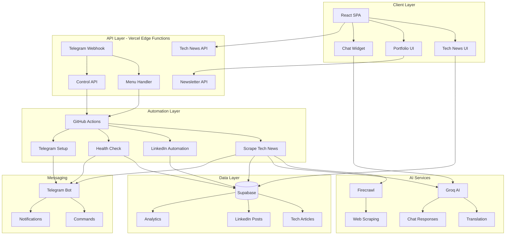

<div align="center">

# 🌐 Tech News Automation Platform

### AI-Powered News Aggregation & Distribution System

[](https://opensource.org/licenses/MIT)
[](https://nodejs.org/)
[](https://www.typescriptlang.org/)
[](https://reactjs.org/)
[](https://vercel.com)

[Live Demo](https://cemkoyluoglu.codes) · [Documentation](#-documentation) · [Report Bug](https://github.com/CemRoot/My-Site/issues) · [Request Feature](https://github.com/CemRoot/My-Site/issues)

</div>

---

## 📋 Table of Contents

- [Overview](#-overview)
- [Key Features](#-key-features)
- [Architecture](#-architecture)
- [Tech Stack](#-tech-stack)
- [Quick Start](#-quick-start)
- [Telegram Bot](#-telegram-bot-control-center)
- [Automation](#-automation-workflows)
- [Configuration](#-configuration)
- [Deployment](#-deployment)
- [Monitoring](#-monitoring--observability)
- [Documentation](#-documentation)
- [Contributing](#-contributing)
- [Security](#-security)
- [License](#-license)

---

## 🎯 Overview

**Tech News Platform** is an enterprise-grade, fully automated news aggregation and distribution system that combines cutting-edge AI, intelligent scraping, and seamless automation to deliver tech news in real-time.

### 🌟 What Makes This Special?

- **🤖 AI-Powered**: Unlimited-length translation using Groq AI (Llama 3.3 70B)
- **📱 Telegram Control Center**: Full system control from your phone
- **🔄 100% Automated**: GitHub Actions + Vercel integration
- **📊 Production-Ready**: Monitoring, health checks, error handling
- **⚡ Lightning Fast**: Supabase backend, optimized queries
- **🔒 Enterprise Security**: Rate limiting, API secrets, fail-safe mechanisms

---

## ✨ Key Features

### 🗞️ News Aggregation System

<table>
<tr>
<td width="50%">

#### Intelligent Scraping
- Multi-category support (7+ categories)
- Smart rate limiting (respects API limits)
- Duplicate detection & prevention
- Source attribution & tracking
- Original article link preservation

</td>
<td width="50%">

#### AI Translation
- Turkish → English translation
- Context-aware processing
- Social media embed preservation
- Markdown formatting retention
- Quality validation checks

</td>
</tr>
</table>

### 🤖 Telegram Bot Control Center

<table>
<tr>
<td width="50%">

#### Interactive Menu System
- 📰 Manual scraping trigger
- 🏥 System health checks
- 📊 Real-time statistics
- 💾 Database management
- 🔧 GitHub Actions control

</td>
<td width="50%">

#### Automated Notifications
- ✅ Success reports
- ❌ Error alerts with details
- 📈 Daily health summaries
- 🚀 Deployment notifications
- 📱 Real-time updates

</td>
</tr>
</table>

### 🔄 Full Automation

- **Scheduled Scraping**: 3x daily on weekdays, health checks
- **Auto Deployment**: Vercel CI/CD with post-build hooks
- **Self-Healing**: Automatic retries, fallback mechanisms
- **Monitoring**: System health tracking, API status checks
- **GitHub Integration**: Workflow triggers, status reporting

### 💼 Portfolio Website

- Modern liquid glass design
- AI-powered chat widget (Groq)
- Responsive & accessible
- SEO optimized
- Dark/Light theme support

---

## 🏗️ Architecture



### 🔄 Data Flow

#### News Aggregation Flow
```
User Request → Vercel Edge Function → Supabase → Response
      ↓
GitHub Actions (Scheduled)
      ↓
Firecrawl Scraping → Groq Translation → Supabase Storage
      ↓
Telegram Notification (Success/Error)
```

#### LinkedIn Digest Flow (New System)
```
n8n Scheduler (16:30 Daily)
      ↓
Fetch Today's Articles → OpenAI GPT-4 (Digest Generation)
      ↓
Save to linkedin_digest_posts (status: pending)
      ↓
Telegram Message (4 Buttons: Approve/Reject/Edit/View)
      ↓
User Clicks "Approve" → Vercel Webhook (api/telegram-webhook.js)
      ↓
Security Checks (UUID validation, Rate limiting, Auth)
      ↓
LinkedIn API Post → Update DB (status: posted)
      ↓
Telegram Confirmation
```

---

## 🛠️ Tech Stack

### Frontend
| Technology | Version | Purpose |
|-----------|---------|---------|
| **React** | 18.3 | UI Framework |
| **TypeScript** | 5.0 | Type Safety |
| **Vite** | 6.3 | Build Tool |
| **Tailwind CSS** | 3.x | Styling |
| **Radix UI** | Latest | Components |
| **React Router** | 7.9 | Navigation |
| **React Markdown** | 10.1 | Content Rendering |

### Backend & APIs
| Service | Purpose | Tier |
|---------|---------|------|
| **Supabase** | PostgreSQL Database | Free/Pro |
| **Groq AI** | Translation & Chat | Free |
| **Firecrawl** | Web Scraping | Free (500/mo) |
| **Telegram Bot API** | Notifications & Control | Free |
| **GitHub Actions** | CI/CD & Automation | Free |

### Infrastructure
| Platform | Purpose | Cost |
|----------|---------|------|
| **Vercel** | Hosting & Edge Functions | Free/Pro |
| **GitHub** | Version Control & Actions | Free |
| **Cloudflare** | DNS & CDN (optional) | Free |

---

## 🚀 Quick Start

### Prerequisites

```bash
node >= 20.0.0
npm >= 10.0.0
git >= 2.40.0
```

### Installation

```bash
# 1. Clone the repository
git clone https://github.com/CemRoot/My-Site.git
cd My-Site

# 2. Install dependencies
npm install

# 3. Setup environment variables
cp .env.example .env

# 4. Add your API keys to .env
# See Configuration section below

# 5. Start development server
npm run dev
```

### First-Time Setup

```bash
# Setup Telegram bot menu
npm run telegram:setup-menu

# Run initial health check
npm run health:check

# Test translation system
npm run test:translation
```

---

## 📱 Telegram Bot Control Center

### Features

The Telegram bot provides complete system control from your mobile device:

```
┌─────────────────────────────────┐
│     🤖 TECH NEWS BOT MENU       │
├─────────────────────────────────┤
│  📰 Haberleri Çek               │
│  🏥 Sağlık Kontrolü             │
│  📊 Sistem Durumu               │
│  📈 İstatistikler               │
│  🔧 GitHub Actions              │
│  💾 Veritabanı                  │
│  🔄 Menüyü Yenile               │
│  ℹ️ Yardım                      │
└─────────────────────────────────┘
```

### Available Commands

| Command | Description |
|---------|-------------|
| `/start` | Initialize bot and show menu |
| `/menu` | Display main control menu |
| `/status` | Quick system status |
| `/scrape` | Trigger news scraping |
| `/health` | Run health check |
| `/help` | Show help and commands |

### Setup

```bash
# 1. Create Telegram bot with @BotFather
# 2. Get bot token and chat ID
# 3. Add to environment variables
TELEGRAM_BOT_TOKEN=your_token
TELEGRAM_CHAT_ID=your_chat_id

# 4. Setup bot menu
npm run telegram:setup-menu

# 5. Test in Telegram
# Send: /start
```

---

## 🔄 Automation Workflows

### Scheduled Jobs

| Workflow | Schedule | Purpose |
|----------|----------|---------|
| **Scrape Tech News** | 09:30, 13:00, 16:00 UTC (M-F) | Collect & translate news |
| **System Health Check** | 08:00 UTC (Daily) | Monitor system health |
| **LinkedIn Automation** | 16:30 UTC (Daily) | Analyze & post content |

### Manual Triggers

All workflows can be triggered manually:

```bash
# Via GitHub Actions UI
Actions → [Workflow Name] → Run workflow

# Via Telegram Bot
/scrape   # Trigger news scraping
/health   # Run health check

# Via API
curl -X POST "https://your-site.com/api/telegram-control?action=trigger-scrape" \
  -H "Authorization: Bearer YOUR_SECRET"
```

### Deployment Automation

```
Git Push → Vercel Build → Post-Build Hook → Bot Setup → Telegram Notification
```

---

## ⚙️ Configuration

### Environment Variables

#### Required for Development

```env
# AI Services
GROQ_API_KEY=gsk_...                    # Groq AI for translation
FIRECRAWL_API_KEY=fc-...                # Firecrawl for scraping

# Database
NEXT_PUBLIC_SUPABASE_URL=https://...    # Supabase project URL
NEXT_PUBLIC_SUPABASE_ANON_KEY=eyJ...    # Public anon key
SUPABASE_SERVICE_ROLE_KEY=eyJ...        # Service role key (admin)

# Telegram Bot
TELEGRAM_BOT_TOKEN=123456:ABC...        # Bot token from @BotFather
TELEGRAM_CHAT_ID=123456789              # Your chat ID
```

#### Optional (Production)

```env
# Security
TELEGRAM_CONTROL_API_SECRET=random_key  # API endpoint security

# GitHub Integration
GITHUB_TOKEN=ghp_...                    # For workflow triggers
GITHUB_REPOSITORY=username/repo         # Repository name

# Analytics
VERCEL_ANALYTICS_ID=your_id            # Vercel Analytics

# LinkedIn Automation (New Digest System)
LINKEDIN_ACCESS_TOKEN=your_linkedin_access_token     # From LinkedIn OAuth
LINKEDIN_PERSON_URN=urn:li:person:YOUR_LINKEDIN_ID   # Your LinkedIn person URN
```

### GitHub Secrets

Add these in: `Repository Settings → Secrets and variables → Actions`

```
GROQ_API_KEY
FIRECRAWL_API_KEY
NEXT_PUBLIC_SUPABASE_URL
SUPABASE_SERVICE_ROLE_KEY
TELEGRAM_BOT_TOKEN
TELEGRAM_CHAT_ID
GITHUB_TOKEN (auto-provided)
```

### Vercel Environment Variables

Add in: `Vercel Dashboard → Project → Settings → Environment Variables`

- Copy all variables from `.env`
- Select: Production, Preview, Development
- Click "Save"

---

## 🚢 Deployment

### Vercel (Recommended)

#### Quick Deploy

[](https://vercel.com/new/clone?repository-url=https://github.com/CemRoot/My-Site)

#### Manual Deploy

```bash
# 1. Install Vercel CLI
npm i -g vercel

# 2. Login to Vercel
vercel login

# 3. Deploy
vercel

# 4. Deploy to production
vercel --prod
```

### Post-Deployment

```bash
# Automatic (via postbuild hook)
# - Bot commands configured
# - Telegram notification sent
# - Menu updated

# Manual setup (if needed)
npm run telegram:setup-menu
```

---

## 📊 Monitoring & Observability

### Health Checks

```bash
# Manual health check
npm run health:check

# Automated (daily at 08:00 UTC)
# - Supabase connection
# - API services status
# - Recent article count
# - System metrics
```

### Telegram Notifications

Automatic notifications for:
- ✅ Successful scraping runs
- ❌ Errors with detailed logs
- 🏥 Daily health reports
- 🚀 Deployment notifications
- 📊 Weekly summaries

### System Dashboard

Access via Telegram bot:
- Real-time statistics
- API status monitoring
- Database metrics
- Error logs
- Performance metrics

---

## 📚 Documentation

### Setup Guides
- [📰 Tech News Setup](./docs/TECH_NEWS_SETUP.md) - Complete scraping system setup
- [🗄️ Supabase Setup](./docs/SUPABASE_SETUP.md) - Database configuration
- [📱 Telegram Bot Setup](./docs/TELEGRAM_NOTIFICATIONS_SETUP.md) - Bot configuration
- [🔧 General Setup](./docs/SETUP.md) - Initial project setup

### System Documentation
- [🏗️ Architecture](./docs/IMPLEMENTATION_SUMMARY.md) - System architecture
- [🔄 Automation](./docs/SYSTEM_RELIABILITY.md) - Reliability & automation
- [📊 Monitoring](./docs/TECH_NEWS_MONITORING.md) - Monitoring system
- [🗃️ Database Schema](./docs/supabase-schema.sql) - PostgreSQL schema

### Deployment Guides
- [🚀 Deployment Checklist](./docs/DEPLOYMENT_CHECKLIST.md) - Pre-deployment checks
- [📦 Vercel Setup](./docs/VERCEL_SETUP_GUIDE.md) - Vercel configuration
- [🔧 Tech News Deployment](./docs/TECH_NEWS_DEPLOYMENT.md) - News system deployment

### API Documentation
- [📡 Telegram Webhook](./api/telegram-webhook.js) - Webhook handler
- [🎛️ Control API](./api/telegram-control.js) - Control endpoints
- [📰 Tech News API](./api/tech-news.js) - News endpoints

---

## 🤝 Contributing

We welcome contributions! Please see our [Contributing Guide](./CONTRIBUTING.md) for details.

### Development Workflow

```bash
# 1. Fork the repository
# 2. Create your feature branch
git checkout -b feature/AmazingFeature

# 3. Commit your changes
git commit -m 'Add some AmazingFeature'

# 4. Push to the branch
git push origin feature/AmazingFeature

# 5. Open a Pull Request
```

### Code Style

- TypeScript for new code
- ESLint + Prettier for formatting
- Meaningful commit messages
- Test your changes locally

---

## 🔒 Security

### Reporting Vulnerabilities

Please report security vulnerabilities to: **cemkoyluoglu@icloud.com**

### Security Features

- ✅ **API Rate Limiting** (10 requests/minute per user)
- ✅ **UUID Validation** (RFC 4122 compliant)
- ✅ **Chat ID Authorization** (Telegram webhook)
- ✅ **Environment Variable Encryption**
- ✅ **Webhook Signature Verification**
- ✅ **SQL Injection Prevention** (Parameterized queries)
- ✅ **XSS Protection** (HTML sanitization)
- ✅ **CORS Configuration** (Origin whitelisting)
- ✅ **LinkedIn API Token Security** (Server-side only)
- ✅ **Duplicate Post Prevention** (Status checks)
- ✅ **Error Message Sanitization** (No sensitive data exposure)

### Best Practices

```bash
# Never commit secrets
echo ".env" >> .gitignore

# Use API secrets
TELEGRAM_CONTROL_API_SECRET=random_64_char_string

# Rotate keys regularly
# - Every 90 days for production
# - Immediately if compromised
```

---

## 📈 Performance

### Metrics

| Metric | Target | Actual |
|--------|--------|--------|
| **Lighthouse Score** | > 90 | 95+ |
| **First Contentful Paint** | < 1.5s | ~1.2s |
| **Time to Interactive** | < 3s | ~2.5s |
| **API Response Time** | < 200ms | ~150ms |
| **Translation Speed** | < 5s | ~3-4s |

### Optimization

- Static generation for pages
- Image optimization (WebP)
- Code splitting & lazy loading
- CDN caching (Vercel Edge)
- Database query optimization
- API response caching

---

## 📜 Scripts Reference

### Development
```bash
npm run dev                     # Start dev server (port 5173)
npm run build                   # Production build
npm run preview                 # Preview production build
```

### Tech News System
```bash
npm run scrape:news             # Manual news scraping
npm run fix:original-sources    # Fix missing source links
npm run migrate:supabase        # Migrate to Supabase
npm run test:translation        # Test translation quality
```

### Telegram Bot
```bash
npm run telegram:setup-menu     # Setup bot menu
npm run telegram:webhook-setup  # Configure webhook
npm run telegram:webhook-remove # Remove webhook
```

### LinkedIn Automation (New Digest System)

**The new system uses n8n + Vercel webhook for LinkedIn digest automation.**

#### Setup Requirements:
1. **n8n Workflow** (provided in docs)
2. **Vercel Webhook** (`api/telegram-webhook.js` - already configured)
3. **Environment Variables:**
   ```bash
   LINKEDIN_ACCESS_TOKEN=your_token
   LINKEDIN_PERSON_URN=urn:li:person:YOUR_ID
   ```

#### How It Works:
1. n8n generates daily digest at 16:30
2. Telegram sends message with 4 buttons
3. Click "Approve" → Automatically posts to LinkedIn
4. All handled by `api/telegram-webhook.js`

#### Legacy Commands (Deprecated):
```bash
npm run linkedin:analyze        # Old system - use n8n instead
npm run linkedin:post           # Old system - use Telegram approval
npm run linkedin:test           # Test LinkedIn credentials
```

**Note:** The legacy `linkedin_posts` table system is deprecated. New system uses `linkedin_digest_posts` with better security and UX.

### Monitoring
```bash
npm run health:check            # System health check
npm run test:webhook            # Test webhook
```

---

## 🎯 Roadmap

### ✅ Completed
- [x] Multi-category news scraping
- [x] AI-powered translation
- [x] Telegram bot control system
- [x] GitHub Actions automation
- [x] Supabase migration
- [x] Health monitoring system
- [x] LinkedIn integration
- [x] Email newsletter signup

### 🚧 In Progress
- [ ] RSS feed generation
- [ ] Article search functionality
- [ ] User bookmarking system
- [ ] Advanced analytics dashboard

### 📋 Planned
- [ ] Multi-language support (Spanish, French)
- [ ] Mobile app (React Native)
- [ ] AI-powered article summarization
- [ ] Social media auto-posting
- [ ] Newsletter email delivery
- [ ] Custom category subscriptions

---

## 💼 Use Cases

### For News Outlets
- Automated content aggregation
- Multi-language translation
- Social media distribution
- Analytics & insights

### For Developers
- Modern React/TypeScript template
- CI/CD best practices
- API integration examples
- Telegram bot implementation

### For Businesses
- Internal news distribution
- Team notifications
- Content curation
- Automated reporting

---

## 🏆 Acknowledgments

- [Groq AI](https://groq.com/) - Lightning-fast AI inference
- [Firecrawl](https://firecrawl.dev/) - Reliable web scraping
- [Supabase](https://supabase.com/) - Open-source Firebase alternative
- [Vercel](https://vercel.com/) - Seamless deployment platform
- [Telegram](https://telegram.org/) - Secure messaging platform

---

## 📞 Contact & Support

<div align="center">

### Dr. Cem Koyluoglu (CK)

[](mailto:cemkoyluoglu@icloud.com)
[](https://www.linkedin.com/in/cem-koyluoglu/)
[](https://github.com/CemRoot)
[](https://wa.me/353873445918)

📍 **Dublin, Ireland** | 🌍 **Available Worldwide**

</div>

---

## 📄 License

This project is licensed under the **MIT License** - see the [LICENSE](LICENSE) file for details.

```
MIT License

Copyright (c) 2025 Cem Koyluoglu

Permission is hereby granted, free of charge, to any person obtaining a copy
of this software and associated documentation files (the "Software"), to deal
in the Software without restriction, including without limitation the rights
to use, copy, modify, merge, publish, distribute, sublicense, and/or sell
copies of the Software, and to permit persons to whom the Software is
furnished to do so, subject to the following conditions:

The above copyright notice and this permission notice shall be included in all
copies or substantial portions of the Software.
```

---

<div align="center">

### ⭐ If you find this project useful, please consider giving it a star!

**Made with ❤️ in Dublin, Ireland**

[⬆ Back to Top](#-tech-news-automation-platform)

---

**Last Updated**: October 17, 2025 | **Version**: 2.0.0

[](https://github.com/CemRoot/My-Site)
[](https://github.com/CemRoot/My-Site)
[](http://makeapullrequest.com)

</div>
