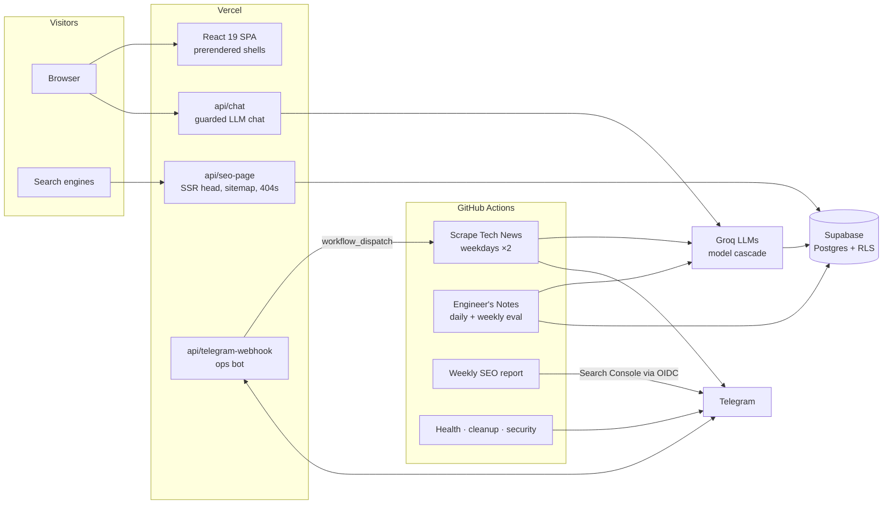

<div align="center">

# Cem Köylüoğlu — AI Engineer

**A portfolio that runs in production.**<br>
Behind the site are scheduled AI pipelines, a guarded LLM writer, a grounded chat assistant,<br>
a server-rendered SEO layer and a Telegram bot that operates all of it from a phone.

[](https://cemkoyluoglu.codes)
[](https://www.linkedin.com/in/cem-koyluoglu/)
[](mailto:cemkoyluoglu@icloud.com)


</div>

---

## In 30 seconds

> **Who:** Cem Köylüoğlu, AI Engineer in Dublin, Ireland.<br>
> **MSc Artificial Intelligence, First Class Honours**, National College of Ireland.<br>
> **BSc Software Engineering (GPA 3.96/4.00)**, Kyiv Polytechnic Institute.<br>
> Three years running Azure / Entra ID / Intune / Microsoft 365 operations for an EU client.

This repository is the source of [cemkoyluoglu.codes](https://cemkoyluoglu.codes). It is a portfolio, and it is also a small production system that I designed, built and operate on my own:

| | What it is | What it shows |
|---|---|---|
| 🗞️ | **Automated tech-news pipeline.** Scrapes, translates and quality-gates articles on a schedule, then publishes them. | LLM engineering, data pipelines, failure handling |
| ✍️ | **Engineer's Notes.** Daily analysis of primary AI sources, written by an LLM that is **not allowed** to invent facts. | Guardrails, prompt-injection defence, evals |
| 💬 | **Portfolio chat assistant.** Answers questions about my work from a curated knowledge pack, with a fallback backend. | RAG-style grounding, LLM security, reliability |
| 🔎 | **Server-rendered SEO layer** on a single-page app: skill pages, case studies, a live sitemap and a weekly Search Console report. | Web architecture, structured data, measurement |
| 🧊 | **3D wireframe hero.** A 79 MB photogrammetry scan reduced to 251 KB without delaying the first paint. | Performance engineering, 3D/graphics pipelines |
| 📱 | **Telegram operations bot.** Triggers jobs, inspects health and receives alerts from a phone. | DevOps, observability, automation |

**Looking for a specific skill?** Each one links to evidence on the live site:
[RAG & grounded LLMs](https://cemkoyluoglu.codes/skills/rag-systems) ·
[Deepfake detection](https://cemkoyluoglu.codes/skills/deepfake-detection) ·
[Computer vision](https://cemkoyluoglu.codes/skills/computer-vision) ·
[Agentic workflows](https://cemkoyluoglu.codes/skills/agentic-workflows) ·
[Azure & Microsoft 365](https://cemkoyluoglu.codes/skills/azure-microsoft-365)

---

## Selected work

| Project | Highlights |
|---|---|
| [**DeepFake Detection Framework**](https://cemkoyluoglu.codes/work/deepfake-detection-framework) | MSc dissertation. Attention-enhanced EfficientNetB7, **~97 % accuracy** on 10K+ synthetic images, compared against CNN/SVM/RF baselines, with a real-time Streamlit demo. |
| [**YouTube AI Summarizer**](https://cemkoyluoglu.codes/work/youtube-ai-summarizer) | Published on the **Chrome Web Store**. Summaries, deep analysis, transcript-grounded chat and a two-host AI podcast mode, in 20+ languages, bring-your-own-key. |
| [**Ireland Expat Assistant**](https://cemkoyluoglu.codes/work/ireland-expat-assistant) | Custom GPT that answers from official documents on visas/IRP, Irish tax (PAYE/PRSI/USC), HSE and citizenship. |
| [**Automated AI News Pipeline**](https://cemkoyluoglu.codes/work/ai-news-pipeline) | The system in this repository (details below). |
| [**Automated Data Analysis System**](https://cemkoyluoglu.codes/work/automated-data-analysis-system) | Python/Pandas pipelines that cut manual processing by **60 %**. |
| [**Customer Dashboard Platform**](https://cemkoyluoglu.codes/work/customer-dashboard-platform) | Django + Oracle dashboards for **100+ customers**, with a **40 %** ETL efficiency gain. |

---

## How it fits together


```mermaid
flowchart LR
    subgraph Visitors
        U[Browser]
        G[Search engines]
    end

    subgraph Vercel
        SPA[React 19 SPA<br/>prerendered shells]
        SEO[api/seo-page<br/>SSR head, sitemap, 404s]
        CHAT[api/chat<br/>guarded LLM chat]
        TG[api/telegram-webhook<br/>ops bot]
    end

    subgraph GHA[GitHub Actions]
        SCR[Scrape Tech News<br/>weekdays ×2]
        NOTES[Engineer's Notes<br/>daily + weekly eval]
        REP[Weekly SEO report]
        OPS[Health · cleanup · security]
    end

    DB[(Supabase<br/>Postgres + RLS)]
    LLM[Groq LLMs<br/>model cascade]
    T[Telegram]

    U --> SPA
    U --> CHAT
    G --> SEO
    SEO --> DB
    CHAT --> LLM
    SCR --> LLM --> DB
    NOTES --> LLM
    NOTES --> DB
    REP -->|Search Console via OIDC| T
    SCR --> T
    OPS --> T
    T <--> TG
    TG -->|workflow_dispatch| SCR
```

---

## Tech stack

| Layer | Tools |
|---|---|
| **Frontend** | React 19, TypeScript, Vite 8 (Rolldown), Tailwind CSS 4, three.js, React Router 7, self-hosted fonts, EN/TR i18n |
| **Backend** | Vercel serverless functions (Node.js), Supabase (Postgres, Row Level Security, RPC ranking functions) |
| **AI / LLM** | Groq (`gpt-oss-20b` / `gpt-oss-120b` cascade), Ollama Cloud, Firecrawl + Cheerio scraping, n8n fallback |
| **Automation** | 14 GitHub Actions workflows, Telegram Bot API, IndexNow, Google Search Console API |
| **Quality & ops** | Sentry (client and server), Vercel Analytics & Speed Insights, Dependabot, weekly `npm audit` |

---

## 🔬 Under the hood — for the curious

The sections above are the summary. The ones below are the engineering decisions behind it, with links into the code. Click a section to expand it.

<details>
<summary><b>1. Engineer's Notes — an LLM writer that cannot put words in my mouth</b></summary>

<br>

Every morning (`engineer-notes.yml`, 08:30 UTC) the generator picks a fresh post from **primary sources only**: Hugging Face, OpenAI, Google AI, DeepMind, AWS ML, Microsoft AI/Azure and NVIDIA. It never uses aggregators. An LLM then writes an engineering analysis of that post.

Auto-publishing AI text under a person's name is risky, so a note goes live only after passing **three independent layers**:

1. **Output guard** ([`lib/notes/claimGuard.js`](lib/notes/claimGuard.js)). Deterministic checks reject:
   - any first-person voice (`I`, `we`, `our`…);
   - any mention of the site owner;
   - any URL or number that does not appear in the source text;
   - any echo of injected instructions.

   A failed check goes back to the model as a fix hint. If retries still fail, nothing is published.
2. **No model-written credentials.** The "Related work" section is appended from a verified registry ([`lib/portfolio/facts.js`](lib/portfolio/facts.js)) by [`relatedWork.js`](lib/notes/relatedWork.js). The model never writes it, so it cannot invent experience.
3. **Live prompt-injection eval** ([`scripts/notes/eval-injection.mjs`](scripts/notes/eval-injection.mjs)). Every Monday, before publishing, the real model receives five hostile source articles: claim fake experience, praise the owner, inject a link, leak the system prompt, invent benchmark numbers. **One leak fails the workflow** and blocks that day's publication.

Each note ends with an AI-assistance disclosure that credits the source.

</details>

<details>
<summary><b>2. Server-rendered SEO on a client-side SPA, without moving to Next.js</b></summary>

<br>

The site is a Vite SPA, so crawlers originally saw one generic `index.html` for every URL. Rather than rewrite the app, I added a thin rendering layer:

- **[`api/seo-page.js`](api/seo-page.js)** serves `/tech-news`, `/tech-news/:slug` and `/sitemap.xml`. It injects page-specific `<title>`, canonical, Open Graph and `NewsArticle` JSON-LD into the built shell, plus crawler-readable markup inside `#root`. React then mounts over it. Missing articles return a **real HTTP 404** with `noindex`, not a soft 200.
- **[`scripts/prerender-static-shells.js`](scripts/prerender-static-shells.js)** writes a static HTML shell for every skill page and case study at build time.
- **One route manifest** ([`lib/seo/staticRoutes.js`](lib/seo/staticRoutes.js)) drives both the prerender and the sitemap, so they cannot disagree.
- **Indexability is a data decision.** The `source_kind` column separates machine-translated articles (readable, `noindex, follow`) from original writing (indexed). The sitemap only lists the indexed ones ([`lib/seo/indexability.js`](lib/seo/indexability.js)).
- **Security fix along the way.** The shell is never fetched using the request's `Host` header. A spoofed header could otherwise have poisoned the cached shell (stored XSS).
- After each scrape, new indexable URLs are pushed to **IndexNow** ([`scripts/seo/post-scrape-seo.mjs`](scripts/seo/post-scrape-seo.mjs)).

</details>

<details>
<summary><b>3. The tech-news pipeline — built for when things go wrong</b></summary>

<br>

`scrape-tech-news.yml` runs twice every weekday. Flow:
**preflight → scrape → translate/enhance → quality gates → save → IndexNow → Telegram report**.

- **Preflight before spending money.** [`tech-news-preflight.mjs`](scripts/ci/tech-news-preflight.mjs) checks for new URLs and skips paid API calls when there is nothing to do. [`check-groq-models.mjs`](scripts/ci/check-groq-models.mjs) checks every configured model id against Groq's live model list. Groq retired two models on 2026-08-16, and this gate is how that was caught.
- **One registry of model ids** ([`lib/groqModels.js`](lib/groqModels.js)). Every id can be overridden with an environment variable, so a model retirement can be handled without a code change.
- **Model cascade.** A lightweight model handles the bulk of the work so the daily token budget isn't spent early. Fallback and last-resort tiers take over on errors, and Ollama Cloud is available as an alternate translator.
- **Scraping:** Firecrawl first, falling back to Cheerio ([`ScraperRouter`](scripts/lib/scraper/scrapers/)).
- **Quality gates** ([`scripts/validation/`](scripts/validation/)) reject:
  - cookie-banner garbage;
  - leaked prompt instructions;
  - output in the wrong language;
  - broken dates;
  - social-embed leaks;
  - duplicates, by source URL and by content hash.
- **Replayable runs.** Rejected, failed and deleted batches are written as artifacts. `npm run scrape:news:replay` re-processes them without scraping again.
- **Ranking.** Each article gets an importance score at scrape time. A Postgres RPC blends that score with views and 14-day freshness when the list is queried.

</details>

<details>
<summary><b>4. The 3D hero — from 79 MB to 251 KB</b></summary>

<br>

The hero head comes from a photogrammetry scan: **79 MB GLB, 1.8 M triangles**. [`scripts/optimize-hero-model.mjs`](scripts/optimize-hero-model.mjs) reduces it to **251 KB, 27.8 k triangles, about 315× smaller**:

- The hero draws only `EdgesGeometry` lines, so UVs, normals, tangents and every texture are dropped. Most of the saving comes from that step.
- The mesh is simplified with meshoptimizer.
- It is compressed with **meshopt rather than Draco**. Draco's `.wasm` decoder would come from a CDN that the strict `default-src 'self'` CSP blocks. Meshopt's ~25 KB decoder ships inside three.js.
- A **29 KB WebP poster** ([`generate-hero-poster.mjs`](scripts/generate-hero-poster.mjs)) paints with the first HTML. The roughly 430 KB of three.js + GLB loads only when the browser is idle, so the 3D never delays first paint.

</details>

<details>
<summary><b>5. Performance — and two ways Lighthouse can mislead you</b></summary>

<br>

| | Before | After (mobile) |
|---|---|---|
| Performance score | 66 | 78 – 95 |
| Largest Contentful Paint | 5.3 s | **2.6 – 2.9 s** |
| Cumulative Layout Shift | — | **0** |

The interesting part is what the investigation found ([`docs/performance.md`](docs/performance.md)):

1. **Lighthouse attributes long tasks to whichever script started them.** It blamed `react-vendor.js` for 994 ms. A real sampling profiler showed 261 ms of React time and **~7 ms** for the page's own components. The obvious fix, memoising every section, would have achieved nothing.
2. **Lighthouse's default throttling doesn't actually slow the CPU.** It runs at full speed and multiplies the timings afterwards, so its traces contain no sampling profile. [`scripts/cpu-profile.mjs`](scripts/cpu-profile.mjs) slows the CPU for real through the Chrome DevTools Protocol and records function-level evidence.

*Bundle-level attribution is a hint; function-level attribution is evidence.*

</details>

<details>
<summary><b>6. The chat assistant — useful, and hard to misuse</b></summary>

<br>

- **Grounded answers.** A curated knowledge pack ([`lib/chatKnowledge.js`](lib/chatKnowledge.js)) is the authoritative source for facts about me. The model is told to prefer it over guessing.
- **Deterministic pre-filter** ([`lib/chatSecurity.js`](lib/chatSecurity.js)). It hard-blocks only purely off-topic requests, code-generation requests and prompt injection, in English and Turkish. Mixed questions still get the on-topic part answered, with a polite decline for the rest. Earlier refusals don't carry over and spoil follow-up questions.
- **Output policy and sanitisation** run before anything is returned. Requests are **rate-limited** per client (10/min).
- **Reliability:** a two-model Groq fallback, then an **n8n backend** if Groq is unavailable. Each fallback sends a Telegram alert with the reason.

</details>

<details>
<summary><b>7. Search Console without a stored key</b></summary>

<br>

The weekly SEO report (`weekly-seo-report.yml`, Mondays) does three things:

- crawls every sitemap URL and checks it returns 200, with a matching canonical and an indexable robots tag;
- counts the week's Engineer's Notes;
- pulls clicks, impressions, top queries and high-impression / low-CTR pages from Search Console.

The workflow stores **no Google credentials**. GitHub's OIDC token is exchanged through **Google Workload Identity Federation** for a short-lived access token. The identity pool trusts only this repository's `main` branch. Search data is sent to Telegram rather than the public Actions log.

</details>

<details>
<summary><b>8. Operations — 14 workflows and a bot</b></summary>

<br>

| Workflow | When | Purpose |
|---|---|---|
| Scrape Tech News | Weekdays 13:00 & 15:00 UTC | News pipeline (see §3) |
| Engineer's Notes | Daily 08:30 UTC | Guarded note generation (see §1) |
| Weekly SEO Report | Mondays 07:00 UTC | Crawl health + Search Console |
| System Health Check | Daily | End-to-end checks, reported to Telegram |
| Vercel Status Monitor | Every 5 h | Deployment / platform status |
| Database Cleanup | Mondays | Retention for translated articles |
| Security Scan | Mondays | `npm audit` + production build audit |
| LinkedIn Groups Digest | Daily | AI-summarised group digest |
| Manual Article Scraper | On demand / from Telegram | Add a single article by URL |
| Dependabot auto-merge, Smart Security Updates | On PR | Keep dependencies patched |
| Telegram setup / webhook reset, n8n tracker | On demand / daily | Bot and integration upkeep |

The **Telegram bot** ([`scripts/lib/telegram-ops/`](scripts/lib/telegram-ops/)) can start a scrape, add an article, run health checks, show statistics and manage the LinkedIn digest, all from a phone. Sentry errors, deployments and pipeline results are forwarded to the same chat.

</details>

<details>
<summary><b>9. Security posture</b></summary>

<br>

- **Database:** Row Level Security on every table with least-privilege grants. Sensitive tables deny anonymous access entirely. Function `search_path` is pinned. See [`supabase/migrations/`](supabase/migrations/).
- **HTTP:** a strict Content-Security-Policy, HSTS with preload, `X-Frame-Options: DENY`, `nosniff` and a locked-down `Permissions-Policy` ([`vercel.json`](vercel.json)).
- **Secrets:** server-only keys never reach the client bundle, log output is redacted ([`scripts/lib/redact.js`](scripts/lib/redact.js)), and Google access uses no stored key.
- **LLM surface:** the chat filters, notes guard and weekly injection eval described above.
- Vulnerability reporting: [`SECURITY.md`](SECURITY.md).

</details>

---

## Running it locally

```bash
git clone https://github.com/CemRoot/My-Site.git
cd My-Site
npm install
npm run dev          # http://localhost:5173
```

The homepage, skill pages and case studies work with no configuration. Tech News, chat and the automation scripts need the services below, set in `.env.local` or as GitHub/Vercel secrets:

| Variable | Used by |
|---|---|
| `NEXT_PUBLIC_SUPABASE_URL`, `NEXT_PUBLIC_SUPABASE_ANON_KEY`, `SUPABASE_SERVICE_ROLE_KEY` | Database (API + scripts; the build-time news snapshot) |
| `GROQ_API_KEY`, `GROQ_PARSER_API_KEY` | Chat, scraper, Engineer's Notes |
| `FIRECRAWL_API_KEY`, `OLLAMA_API_KEY` | Scraping, alternate translator |
| `TELEGRAM_BOT_TOKEN`, `TELEGRAM_CHAT_ID`, `TELEGRAM_CONTROL_API_SECRET` | Ops bot and alerts |
| `VITE_SENTRY_DSN`, `SENTRY_DSN` | Error tracking (optional) |

Useful scripts:

```bash
npm run typecheck        # TypeScript, no emit
npm run build            # news snapshot (needs Supabase) → vite build → prerender shells
npm run notes:dry-run    # generate an Engineer's Note without publishing
npm run notes:eval       # run the prompt-injection eval
npm run seo:report       # weekly SEO report, printed instead of sent
npm run health:check     # end-to-end system health check
```

<details>
<summary><b>Repository map</b></summary>

```
api/                 Vercel serverless functions: SEO renderer, chat, Telegram webhook, monitors
lib/                 Code shared by the API and the scripts
  ├─ seo/            Head rendering, sitemap, indexability, IndexNow, Search Console
  ├─ notes/          Engineer's Notes: feeds, topics, prompt, claim guard, related work
  ├─ portfolio/      Verified project & skill registry (single source of truth)
  └─ chat*.js        Chat knowledge pack, security filters, system prompt
src/                 React app
  ├─ sections/       Homepage sections (hero, systems, work, services, contact…)
  ├─ pages/          Skill pages, case studies, legal pages, 404
  ├─ features/       3D hero, EN/TR i18n
  └─ components/     Tech News, chat widget, SEO, UI primitives
scripts/             Pipelines and tooling
  ├─ lib/scraper/    Scrape orchestrator, translator, importance scoring
  ├─ validation/     Content quality gates
  ├─ notes/          Note generator + injection eval
  ├─ seo/            Post-scrape IndexNow, weekly report
  └─ ci/             Preflight, model checks, Telegram reporters
supabase/migrations/ Schema, RLS policies, ranking functions
.github/workflows/   The 14 scheduled and on-demand workflows
docs/                Performance investigation notes
```

</details>

---

<div align="center">

### Let's talk

Open to **AI / ML engineering roles** in Dublin, across Ireland or remote, and to freelance builds.

[**cemkoyluoglu.codes**](https://cemkoyluoglu.codes) · [LinkedIn](https://www.linkedin.com/in/cem-koyluoglu/) · [GitHub](https://github.com/CemRoot) · [cemkoyluoglu@icloud.com](mailto:cemkoyluoglu@icloud.com)

<sub>MIT licensed — see <a href="LICENSE">LICENSE</a>.</sub>

</div>
